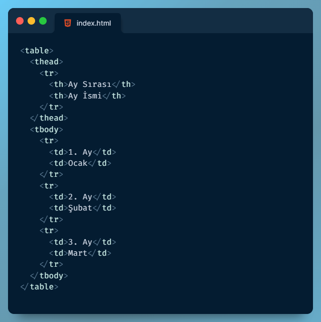

Ders-02: HTML  
Konular: Tablolar, iframe, form, label, input, br, buton

1. Tablolar (table Etiketi)  
	HTML sayfasına tablo eklemek için ```<table>``` etiketi kullanılır. Tabloya üst içerik eklemek için ```<thead>```,  tablo gövdesi için de ```<tbody>``` etiketi kullanılmaktadır. Tabloya satır ekleyebilmek için ```<tr>```, her bir hücre için ise ```<td>``` etiketi kullanılmaktadır. Tabloya başlık hücresi eklemek için ```<th>``` etiketi kullanılır ve tablonun en alt kısına veri ekleyebilmek için ise ```<tfoot>``` etiketi kullanılmaktadır.  
	```<table>```: Sayfaya tablo eklemek için kullanılır.  
	```<thead>```: Tabloya üst içerik eklemek için kullanılır.  
	```<tbody>```: Tablonun gövdesini oluşturabilmek için kullanılır.  
	```<tr>```: Tablo içerisinde satır oluşturmak için kullanılır.  
  ```<td>```: Tablo satırındaki her bir hücreyi belirlemek için kullanılır.  
  ```<th>```: ```<thead>``` içerisinde başlık hücrelerini belirlemek için kullanılır.  
  ```<tfood>```: Tablonun alt kısmını eklemek için kullanılır.  
    
  <h4>Çıktısı Aşağıdaki Gibidir.</h4>  
  <table>
  <thead>
    <tr>
      <th>Ay Sırası</th>
      <th>Ay İsmi</th>
    </tr>
  </thead>
  <tbody>
    <tr>
      <td>1. Ay</td>
      <td>Ocak</td>
    </tr>
    <tr>
      <td>2. Ay</td>
      <td>Şubat</td>
    </tr>
    <tr>
      <td>3. Ay</td>
      <td>Mart</td>
    </tr>
  </tbody>
</table>  
