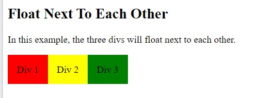
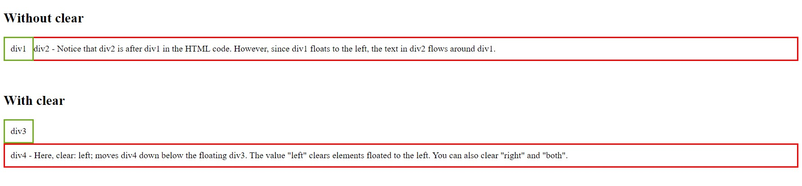
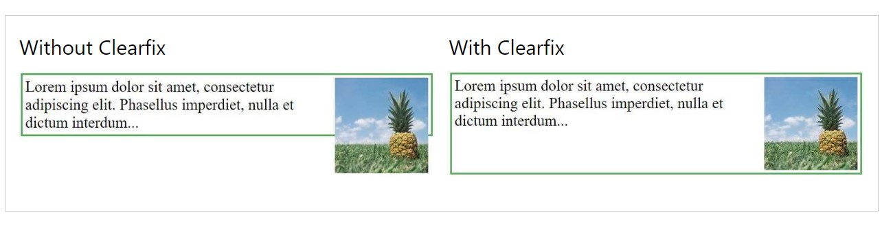
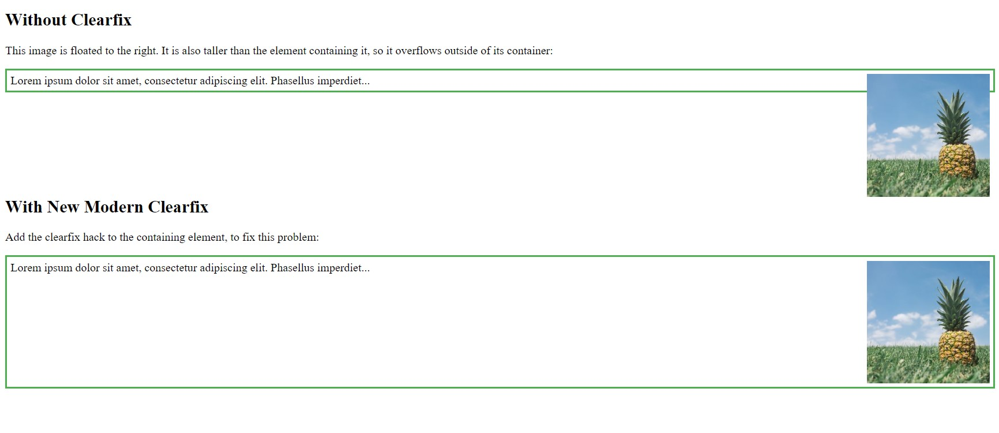

[Turn Back](../../../)
<h1 align="center">Ders04 - CSS Float</h1>

<h3 align="center">Languages and Tools:</h3>

  

# Introduction to CSS

## Contents:
 - [Categories](#categories)
      - [CSS Layout](#css-layout-float-and-clear)
      - [The float Property](#the-float-property)
      - [Float Next To Each Other](#float-next-to-each-other)
      - [The clear Property](#the-clear-property)
      - [The clearfix Hack](#the-clearfix-hack)
      - [Example Website](#example-website)

## CSS Layout (float and clear)

The CSS `float` property specifies how an element should float.

The CSS `clear` property specifies what elements can float beside the cleared element and on which side.

## The float Property

The  property is used for positioning and formatting content e.g. let an image float left to the text in a container.

The `float` property can have one of the following values:

- `left` - The element floats to the left of its container
- `right` - The element floats to the right of its container
- `none `- The element does not float (will be displayed just where it occurs in the text). This is default
- `inherit` - The element inherits the float value of its parent

In its simplest use, the float property can be used to wrap text around images.

### Example

    img {
      float: right;
    }

#### Result:

## Float Next To Each Other

Normally div elements will be displayed on top of each other. However, if we use float: left we can let elements float next to each other:

### Example

    div {
      float: left;
      padding: 15px;
    }

    .div1 {
      background: red;
    }

    .div2 {
      background: yellow;
    }

    .div3 {
      background: green;
    }

#### Result:

## The clear Property

When we use the `float` property, and we want the next element below (not on right or left), we will have to use the `clear` property.

The `clear` property specifies what should happen with the element that is next to a floating element.

The `clear` property can have one of the following values:

- `none` - The element is not pushed below left or right floated elements. This is default
- `left` - The element is pushed below left floated elements
- `right`- The element is pushed below right floated elements
- `both` - The element is pushed below both left and right floated elements
- `inherit` - The element inherits the clear value from its parent

#### Note&#10071;
When clearing floats, you should match the clear to the float: If an element is floated to the left, then you should clear to the left. Your floated element will continue to float, but the cleared element will appear below it on the web page.

### Example

    .div1 {
      float: left;
      padding: 10px;
      border: 3px solid #73AD21;
    }

    .div2 {
      padding: 10px;
      border: 3px solid red;
    }

    .div3 {
      float: left;
      padding: 10px;  
      border: 3px solid #73AD21;
    }

    .div4 {
      padding: 10px;
      border: 3px solid red;
      clear: left;
    }

#### Result:

## The clearfix Hack

If a floated element is taller than the containing element, it will "overflow" outside of its container. We can then add a clearfix hack to solve this problem:

### Example

    div {
      border: 3px solid #4CAF50;
      padding: 5px;
    }

    .img1 {
      float: right;
    }

    .img2 {
      float: right;
    }

    .clearfix {
      overflow: auto;
    }

#### Result:

The `overflow: auto` clearfix works well as long as you are able to keep control of your margins and padding (else you might see scrollbars). The <b>new, modern clearfix hack</b> however, is safer to use, and the following code is used for most webpages:

### Example

    div {
      border: 3px solid #4CAF50;
      padding: 5px;
    }

    .img1 {
      float: right;
    }

    .img2 {
      float: right;
    }

    .clearfix::after {
      content: "";
      clear: both;
      display: table;
    }

#### Result:

####  <a href="https://www.w3schools.com/css/css_float_examples.asp">Visit for more examples ..</a>

## Example Website

