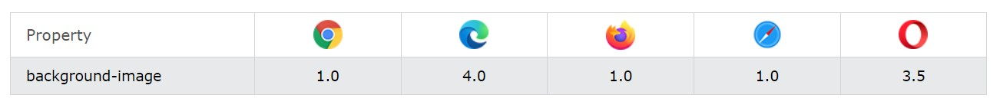

[Turn Back](../../../)
<h1 align="center">Ders05 - CSS Bg Image</h1>

<h3 align="center">Languages and Tools:</h3>

  

# Introduction to CSS

## Contents:
 - [Categories](#categories)
      - [CSS background-image](#css-background-image)
      - [CSS background-origin](#css-background-origin)
      - [CSS background-position](#css-background-position)
      - [CSS background-position-x](#css-background-position-x)
      - [CSS background-position-y](#css-background-position-y)
      - [CSS background-repeat](#css-background-repeat)
      - [CSS background-size](#css-background-size)
      - [Example Website](#example-website)

## CSS background-image

The `background-image` property sets one or more background images for an element.

By default, a background-image is placed at the top-left corner of an element, and repeated both vertically and horizontally.

<b>Note</b>&#10071; The background of an element is the total size of the element, including padding and border (but not the margin).

<b>Note</b>&#10071; Always set a background-color to be used if the image is unavailable.

### Browser Support

The numbers in the table specify the first browser version that fully supports the property.

<b>Note</b>&#10071; IE8 and earlier do not support multiple background images.

### Property Values

<table>
  <tbody><tr>
    <th>Value</th>
    <th>Description</th>
    <th>Demo</th>            
  </tr>  
  <tr>
    <td>url('<i>URL</i>')</td>
    <td>The URL to the image. To specify more than one image, separate the URLs with a comma</td>
    <td><a target="_blank" href="https://www.w3schools.com/cssref/playdemo.php?filename=playcss_background-image&preval=url(%27paper.gif%27)">Demo ❯</a></td>   
  </tr>
  <tr>
    <td>none</td>
    <td>No background image will be displayed. This is default</td>
    <td></td>
  </tr>
  <tr>
    <td><a target="_blank" href="https://www.w3schools.com/cssref/func_conic-gradient.php">conic-gradient()</a></td>
    <td>Sets a conic gradient as the background image. Define at least two 
    colors</td>
    <td><a target="_blank" href="https://www.w3schools.com/cssref/playdemo.php?filename=playcss_background-image&preval=conic-gradient(red,%20yellow,%20green)">Demo ❯</a></td>       
    </tr>
  <tr>
    <td><a target="_blank" href="https://www.w3schools.com/cssref/func_linear-gradient.php">linear-gradient()</a></td>
    <td>Sets a linear gradient as the background image. Define at least two 
    colors (top to bottom)</td>
    <td><a target="_blank" href="https://www.w3schools.com/cssref/playdemo.php?filename=playcss_background-image&preval=linear-gradient(red,%20yellow,%20blue)">Demo ❯</a></td>           
    </tr>
  <tr>
    <td><a target="_blank" href="https://www.w3schools.com/cssref/func_radial-gradient.php">radial-gradient()</a></td>
    <td>Sets a radial gradient as the background image. Define at least two 
    colors (center to edges)</td>
    <td><a target="_blank" href="https://www.w3schools.com/cssref/playdemo.php?filename=playcss_background-image&preval=radial-gradient(red,%20green,%20blue)">Demo ❯</a></td>              
    </tr>
  <tr>
    <td><a target="_blank" href="https://www.w3schools.com/cssref/func_repeating-conic-gradient.php">repeating-conic-gradient()</a></td>
    <td>Repeats a conic gradient</td>
    <td><a target="_blank" href="https://www.w3schools.com/cssref/playdemo.php?filename=playcss_background-image&preval=repeating-conic-gradient(red%2010%25,%20yellow%2020%25)">Demo ❯</a></td>                  
    </tr>
  <tr>
    <td><a target="_blank" href="https://www.w3schools.com/cssref/func_repeating-linear-gradient.php">repeating-linear-gradient()</a></td>
    <td>Repeats a linear gradient</td>
    <td><a target="_blank" href="https://www.w3schools.com/cssref/playdemo.php?filename=playcss_background-image&preval=repeating-linear-gradient(red,%20yellow%2010%25,%20green%2020%25)">Demo ❯</a></td>                  
    </tr>
  <tr>
    <td><a target="_blank" href="https://www.w3schools.com/cssref/func_repeating-radial-gradient.php">repeating-radial-gradient()</a></td>
    <td>Repeats a radial gradient</td>
    <td><a target="_blank" href="https://www.w3schools.com/cssref/playdemo.php?filename=playcss_background-image&preval=repeating-radial-gradient(red,%20yellow%2010%25,%20green%2015%25)">Demo ❯</a></td>                  
    </tr>
  <tr>
    <td>initial</td>
    <td>Sets this property to its default value. <a target="_blank" href="https://www.w3schools.com/cssref/css_initial.php">Read about <em>initial</em></a></td>
    <td></td>
    </tr>
  <tr>
    <td>inherit</td>
    <td>Inherits this property from its parent element. <a target="_blank" href="https://www.w3schools.com/cssref/css_inherit.php">Read about <em>inherit</em></a></td>
    <td></td>
    </tr>
</tbody></table>

## CSS background-origin

The `background-origin` property specifies the origin position (the background positioning area) of a background image.

<b>Note</b>&#10071; This property has no effect if background-attachment is "fixed".

### Property Values

<table>
  <tbody><tr>
    <th style="width:20%">Value</th>
    <th style="width:68%">Description</th>
    <th>Demo</th>                
  </tr>  
  <tr>
    <td>padding-box</td>
    <td>Default value. The background image starts from the upper left corner of the padding edge</td>
  <td><a target="_blank" href="https://www.w3schools.com/cssref/playdemo.php?filename=playcss_background-origin">Demo ❯</a></td>
  </tr>
  <tr>
    <td>border-box</td>
    <td>The background image starts from the upper left corner of the border</td>
  <td><a target="_blank" href="https://www.w3schools.com/cssref/playdemo.php?filename=playcss_background-origin&preval=border-box">Demo ❯</a></td>
  </tr>
  <tr>
    <td>content-box</td>
    <td>The background image starts from the upper left corner of the content</td>
  <td><a target="_blank" href="https://www.w3schools.com/cssref/playdemo.php?filename=playcss_background-origin&preval=content-box">Demo ❯</a></td>
  </tr>
  <tr>
    <td>initial</td>
    <td>Sets this property to its default value. <a href="https://www.w3schools.com/cssref/css_initial.php">Read about <em>initial</em></a></td>
  <td></td>
    </tr>
  <tr>
    <td>inherit</td>
    <td>Inherits this property from its parent element. <a href="https://www.w3schools.com/cssref/css_inherit.php">Read about <em>inherit</em></a></td>
  <td></td>
    </tr>
  </tbody></table>

## CSS background-position

The `background-position` property sets the starting position of a background image.

<b>Note</b>&#10071; By default, a `background-image` is placed at the top-left corner of an element, and repeated both vertically and horizontally.

### Property Values

<table>
  <tbody><tr>
    <th style="width:18%">Value</th>
    <th>Description</th>
    <th>Demo</th>    
  </tr>  
  <tr>
    <td>left top 
      left center 
      left bottom 
      right top 
      right center 
      right bottom 
      center top 
      center center 
      center bottom</td>
    <td>If you only specify one keyword, the other value will be "center"</td>
  <td><a target="_blank" href="https://www.w3schools.com/cssref/playdemo.php?filename=playcss_background-position">Demo ❯</a></td>
  </tr>
  <tr>
    <td><i>x% y%</i></td>
    <td>The first value is the horizontal position and the second
      value is the vertical. The top left corner is 0% 0%.
      The right bottom corner is 100% 100%. If you only specify one
      value, the other value will be 50%. Default value is: 0% 0%</td>
  <td><a target="_blank" href="https://www.w3schools.com/cssref/playdemo.php?filename=playcss_background-position&preval=10%25%2040%25">Demo ❯</a></td>
  </tr>
  <tr>
    <td><i>xpos ypos</i></td>
    <td>The first value&nbsp;is the horizontal position and the second
      value is the vertical. The top left corner is 0 0. Units can be pixels
      (0px 0px) or any other <a href="https://www.w3schools.com/cssref/css_units.php">CSS units</a>. If you only specify one value, the other value will be 50%. You can mix % and positions</td>

  <td><a target="_blank" href="https://www.w3schools.com/cssref/playdemo.php?filename=playcss_background-position&preval=50px%20100px">Demo ❯</a></td>
  </tr>
  <tr>
    <td>initial</td>
    <td>Sets this property to its default value. <a href="https://www.w3schools.com/cssref/css_initial.php">Read about <em>initial</em></a></td>
  <td></td>
    </tr>
  <tr>
    <td>inherit</td>
    <td>Inherits this property from its parent element. <a href="https://www.w3schools.com/cssref/css_inherit.php">Read about <em>inherit</em></a></td>
  <td></td>
    </tr>
</tbody></table>

## CSS background-position-x 

The `background-position-x` property sets the position of a background image on the x-axis.

<b>Note</b>&#10071; By default, a `background-image` is placed at the top-left corner of an element, and repeated both vertically and horizontally.

### Property Values

<table>
  <tbody><tr>
    <th style="width:18%">Value</th>
    <th>Description</th>
    <th>Demo</th>    
  </tr>  
  <tr>
    <td>left</td>
    <td>Positions background left side on x-axis.</td>
    <td><a target="_blank" href="https://www.w3schools.com/cssref/playdemo.php?filename=playcss_background-position-x&preval=left">Demo ❯</a></td>
  </tr>
  <tr>
    <td>right</td>
    <td>Positions background right side on x-axis.</td>
    <td><a target="_blank" href="https://www.w3schools.com/cssref/playdemo.php?filename=playcss_background-position-x&preval=right">Demo ❯</a></td>
  </tr>
  <tr>
    <td>center</td>
    <td>Positions background center on x-axis.</td>
    <td><a target="_blank" href="https://www.w3schools.com/cssref/playdemo.php?filename=playcss_background-position-x&preval=center">Demo ❯</a></td>
  </tr>
  <tr>
    <td><i>x%</i></td>
    <td>Left side is 0% on x-axis, and right side is 100%. Percentage value refers to width of background positioning area minus width of background image.</td>
  <td><a target="_blank" href="https://www.w3schools.com/cssref/playdemo.php?filename=playcss_background-position-x&preval=70%25">Demo ❯</a></td>
  </tr>
  <tr>
    <td><i>xpos</i></td>
    <td>Horizontal distance from left side. Units can be pixels (0px)
      or any other <a target="_blank" href="https://www.w3schools.com/cssref/css_units.php">CSS units</a>.</td>

  <td><a target="_blank" href="https://www.w3schools.com/cssref/playdemo.php?filename=playcss_background-position-x&preval=100px">Demo ❯</a></td>
  </tr>
  <tr>
    <td><i>xpos offset</i></td>
    <td>Two value syntax, only supported in Firefox and Safari.  
    - <i>xpos</i> is set either to "left" or "right".   
    - <i>offset</i> is horizontal distance from background image and "left" or "right" side set with <i>xpos</i>. Units can be pixels or any other <a target="_blank" href="https://www.w3schools.com/cssref/css_units.php">CSS units</a>.</td>
  <td></td>
  </tr>
  <tr>
    <td>initial</td>
    <td>Sets this property to its default value. <a target="_blank" href="https://www.w3schools.com/cssref/css_initial.php">Read about <em>initial</em></a></td>
  <td></td>
    </tr>
  <tr>
    <td>inherit</td>
    <td>Inherits this property from its parent element. <a target="_blank" href="https://www.w3schools.com/cssref/css_inherit.php">Read about <em>inherit</em></a></td>
  <td></td>
    </tr>
</tbody></table>

## CSS background-position-y

The `background-position-y` property sets the position of a background image on the y-axis.

<b>Note</b>&#10071; By default, a `background-image` is placed at the top-left corner of an element, and repeated both vertically and horizontally.

### Property Values

<table>
  <tbody><tr>
    <th style="width:18%">Value</th>
    <th>Description</th>
    <th>Demo</th>    
  </tr>  
  <tr>
    <td>top</td>
    <td>Positions background top on y-axis.</td>
    <td><a target="_blank" href="https://www.w3schools.com/cssref/playdemo.php?filename=playcss_background-position-y&preval=top">Demo ❯</a></td>
  </tr>
  <tr>
    <td>bottom</td>
    <td>Positions background bottom on y-axis.</td>
    <td><a target="_blank" href="https://www.w3schools.com/cssref/playdemo.php?filename=playcss_background-position-y&preval=bottom">Demo ❯</a></td>
  </tr>
  <tr>
    <td>center</td>
    <td>Positions background center on y-axis.</td>
    <td><a target="_blank" href="https://www.w3schools.com/cssref/playdemo.php?filename=playcss_background-position-y&preval=center">Demo ❯</a></td>
  </tr>
  <tr>
    <td><i>y%</i></td>
    <td>Top side is 0% on y-axis, and bottom side is 100%. Percentage value refers to height of background positioning area minus height of background image.</td>
    <td><a target="_blank" href="https://www.w3schools.com/cssref/playdemo.php?filename=playcss_background-position-y&preval=80%25">Demo ❯</a></td>
  </tr>
  <tr>
    <td><i>ypos</i></td>
    <td>Vertical distance from top side. Units can be pixels (0px)
      or any other <a href="https://www.w3schools.com/cssref/css_units.php">CSS units</a>.</td>
    <td><a target="_blank" href="https://www.w3schools.com/cssref/playdemo.php?filename=playcss_background-position-y&preval=50px">Demo ❯</a></td>
  </tr>
  <tr>
    <td><i>ypos offset</i></td>
    <td>Two value syntax, only supported in Firefox and Safari.  
    - <i>ypos</i> is set either to "top" or "bottom".   
    - <i>offset</i> is vertical distance from background image and "top" or "bottom" side set with <i>ypos</i>. Units can be pixels or any other <a href="https://www.w3schools.com/cssref/css_units.php">CSS units</a>.</td>
    <td></td>
  </tr>
  <tr>
    <td>initial</td>
    <td>Sets this property to its default value. <a href="https://www.w3schools.com/cssref/css_initial.php">Read about <em>initial</em></a></td>
    <td></td>
  </tr>
  <tr>
    <td>inherit</td>
    <td>Inherits this property from its parent element. <a href="https://www.w3schools.com/cssref/css_inherit.php">Read about <em>inherit</em></a></td>
    <td></td>
  </tr>
</tbody></table>

## CSS background-repeat

The `background-repeat` property sets if/how a background image will be repeated.

By default, a `background-image` is repeated both vertically and horizontally.

<b>Note</b>&#10071; The background image is placed according to the `background-position` property. If no background-position is specified, the image is always placed at the element's top left corner.

### Property Values

<table>
  <tbody><tr>
    <th style="width:20%">Value</th>
    <th>Description</th>
    <th>Demo</th>        
  </tr>  
  <tr>
    <td>repeat</td>
    <td>The background image is repeated both vertically and
      horizontally.&nbsp; The last image will be clipped if it does not fit. This is default</td>
  <td><a target="_blank" href="https://www.w3schools.com/cssref/playdemo.php?filename=playcss_background-repeat">Demo ❯</a></td>
  </tr>
  <tr>
    <td>repeat-x</td>
    <td>The background image is repeated only horizontally</td>
  <td><a target="_blank" href="https://www.w3schools.com/cssref/playdemo.php?filename=playcss_background-repeat&preval=repeat-x">Demo ❯</a></td>    
  </tr>
  <tr>
    <td>repeat-y</td>
    <td>The background image is repeated only vertically</td>
  <td><a target="_blank" href="https://www.w3schools.com/cssref/playdemo.php?filename=playcss_background-repeat&preval=repeat-y">Demo ❯</a></td>        
  </tr>
  <tr>
    <td>no-repeat</td>
    <td>The background-image is not repeated. The image will only be shown 
    once</td>
  <td><a target="_blank" href="https://www.w3schools.com/cssref/playdemo.php?filename=playcss_background-repeat&preval=no-repeat">Demo ❯</a></td>    
  </tr>
  <tr>
    <td>space</td>
    <td>The background-image is repeated as much as possible without clipping. 
    The first and last image is pinned to either side of the element, and 
    whitespace is distributed evenly between the images</td>
  <td><a target="_blank" href="https://www.w3schools.com/cssref/playdemo.php?filename=playcss_background-repeat&preval=space">Demo ❯</a></td>        
  </tr>
  <tr>
    <td>round</td>
    <td>The background-image is repeated and squished or stretched to fill the 
    space (no gaps)</td>
  <td><a target="_blank" href="https://www.w3schools.com/cssref/playdemo.php?filename=playcss_background-repeat&preval=round">Demo ❯</a></td>        
  </tr>
  <tr>
    <td>initial</td>
    <td>Sets this property to its default value. <a href="https://www.w3schools.com/cssref/css_initial.php">Read about <em>initial</em></a></td>
  <td></td>    
    </tr>
  <tr>
    <td>inherit</td>
    <td>Inherits this property from its parent element. <a href="https://www.w3schools.com/cssref/css_inherit.php">Read about <em>inherit</em></a></td>
  <td></td>
    </tr>
</tbody></table>

## CSS background-size

The `background-size` property specifies the size of the background images.

There are four different syntaxes you can use with this property: the keyword syntax ("auto", "cover" and "contain"), the one-value syntax (sets the width of the image (height becomes "auto"), the two-value syntax (first value: width of the image, second value: height), and the multiple background syntax (separated with comma).

### Property Values

<table>
  <tbody><tr>
    <th style="width:20%">Value</th>
    <th style="width:68%">Description</th>
    <th>Demo</th>                
  </tr>  
  <tr>
    <td>auto</td>
    <td>Default value. The background image is displayed in its original size</td>
  <td><a target="_blank" href="https://www.w3schools.com/cssref/playdemo.php?filename=playcss_background-size&preval=auto">Demo ❯</a></td>
  </tr>
  <tr>
    <td><em>length</em></td>
    <td>Sets the width and height of the background image. The first value sets the width, the second value sets the height. If only one value is given, the second is set to "auto". <a target="_blank" href="https://www.w3schools.com/cssref/css_units.php">Read about length units</a></td>
  <td><a target="_blank" href="https://www.w3schools.com/cssref/playdemo.php?filename=playcss_background-size&preval=30px">Demo ❯</a></td>
  </tr>
  <tr>
    <td><em>percentage</em></td>
    <td>Sets the width and height of the background image in percent of the parent element. The first value sets the width, the second value sets the height. If only one value is given, the second is set to "auto"</td>
  <td><a target="_blank" href="https://www.w3schools.com/cssref/playdemo.php?filename=playcss_background-size&preval=50%25">Demo ❯</a></td> 
  </tr>
  <tr>
    <td> cover</td>
    <td>Resize the background image to cover the entire container, even if it 
    has to stretch the image or cut a little bit off one of the edges</td>
  <td><a target="_blank" href="https://www.w3schools.com/cssref/playdemo.php?filename=playcss_background-size&preval=cover">Demo ❯</a></td>  
  </tr>
  <tr>
    <td> contain</td>
    <td>Resize the background image to make sure the image is fully visible</td>
  <td><a target="_blank" href="https://www.w3schools.com/cssref/playdemo.php?filename=playcss_background-size&preval=contain">Demo ❯</a></td>  
  </tr>
  <tr>
    <td>initial</td>
    <td>Sets this property to its default value. <a href="https://www.w3schools.com/cssref/css_initial.php">Read about <em>initial</em></a></td>
  <td></td>  
    </tr>
  <tr>
    <td>inherit</td>
    <td>Inherits this property from its parent element. <a href="https://www.w3schools.com/cssref/css_inherit.php">Read about <em>inherit</em></a></td>
  <td></td>
    </tr>
</tbody></table>

## Example Website

