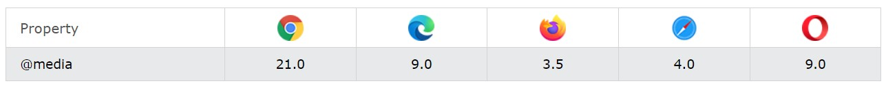

[Turn Back](../../../)
<h1 align="center">Ders05 - CSS Pseudo</h1>

<h3 align="center">Languages and Tools:</h3>

  

# Introduction to CSS

## Contents:
 - [Categories](#categories)
      - [CSS Pseudo Classes](#css-pseudo-classes)
      - [CSS Pseudo Elements](#css-pseudo-elements)
      - [CSS Media Queries](#css-media-queries)
      - [Example Website](#example-website)

## CSS Pseudo Classes

A pseudo-class is used to define a special state of an element.

For example, it can be used to:

- Style an element when a user mouses over it
- Style visited and unvisited links differently
- Style an element when it gets focus

### Syntax

The syntax of pseudo-classes:

    selector:pseudo-class {
      property: value;
    }

<b>Note</b>&#10071; `a:hover` MUST come after `a:link` and `a:visited` in the CSS definition in order to be effective! `a:active` MUST come after `a:hover` in the CSS definition in order to be effective! Pseudo-class names are not case-sensitive.

### The :first-child Pseudo-class

The `:first-child` pseudo-class matches a specified element that is the first child of another element.

In the following example, the selector matches any `
` element that is the first child of any element:

    p:first-child {
      color: blue;
    }

In the following example, the selector matches the first <i> element in all 
 elements:

    p i:first-child {
      color: blue;
    }

### The :lang Pseudo-class

The `:lang` pseudo-class allows you to define special rules for different languages.

In the example below, `:lang` defines the quotation marks for `<q>` elements with lang="no":

    <html>
    <head>
    
    </head>
    <body>

    
Some text <q lang="no">A quote in a paragraph</q> Some text.

    </body>
    </html>

### All CSS Pseudo Classes

<table>
  <tbody><tr>
    <th>Selector</th>
    <th>Example</th>
    <th>Example description</th>
  </tr>
  <tr>
    <td><a href="https://www.w3schools.com/cssref/sel_active.php">:active</a></td>
    <td>a:active</td>
    <td>Selects the active link</td>
  </tr>
  <tr>
    <td><a href="https://www.w3schools.com/cssref/sel_checked.php">:checked</a></td>
    <td>input:checked</td>
    <td>Selects every checked &lt;input&gt; element</td>
  </tr>
  <tr>
    <td><a href="https://www.w3schools.com/cssref/sel_disabled.php">:disabled</a></td>
    <td>input:disabled</td>
    <td>Selects every disabled &lt;input&gt; element</td>
  </tr>
  <tr>
    <td><a href="https://www.w3schools.com/cssref/sel_empty.php">:empty</a></td>
    <td>p:empty</td>
    <td>Selects every &lt;p&gt; element that has no children</td>
  </tr>
  <tr>
    <td><a href="https://www.w3schools.com/cssref/sel_enabled.php">:enabled</a></td>
    <td>input:enabled</td>
    <td>Selects every enabled &lt;input&gt; element</td>
  </tr>
  <tr>
    <td><a href="https://www.w3schools.com/cssref/sel_firstchild.php">:first-child</a></td>
    <td>p:first-child</td>
    <td>Selects every &lt;p&gt; elements that is the first child of its parent</td>
  </tr>
  <tr>
    <td><a href="https://www.w3schools.com/cssref/sel_first-of-type.php">:first-of-type</a></td>
    <td>p:first-of-type</td>
    <td>Selects every &lt;p&gt; element that is the first &lt;p&gt; element of its parent</td>
  </tr>
  <tr>
    <td><a href="https://www.w3schools.com/cssref/sel_focus.php">:focus</a></td>
    <td>input:focus</td>
    <td>Selects the &lt;input&gt; element that has focus</td>
  </tr>
  <tr>
    <td><a href="https://www.w3schools.com/cssref/sel_hover.php">:hover</a></td>
    <td>a:hover</td>
    <td>Selects links on mouse over</td>
  </tr>
  <tr>
    <td><a href="https://www.w3schools.com/cssref/sel_in-range.php">:in-range</a></td>
    <td>input:in-range</td>
    <td>Selects &lt;input&gt; elements with a value within a specified range</td>
  </tr>
  <tr>
    <td><a href="https://www.w3schools.com/cssref/sel_invalid.php">:invalid</a></td>
    <td>input:invalid</td>
    <td>Selects all &lt;input&gt; elements with an invalid value</td>
  </tr>
  <tr>
    <td><a href="https://www.w3schools.com/cssref/sel_lang.php">:lang(<i>language</i>)</a></td>
    <td>p:lang(it)</td>
    <td>Selects every &lt;p&gt; element with a lang attribute value starting with "it"</td>
  </tr>
  <tr>
    <td><a href="https://www.w3schools.com/cssref/sel_last-child.php">:last-child</a></td>
    <td>p:last-child</td>
    <td>Selects every &lt;p&gt; elements that is the last child of its parent</td>
  </tr>
  <tr>
    <td><a href="https://www.w3schools.com/cssref/sel_last-of-type.php">:last-of-type</a></td>
    <td>p:last-of-type</td>
    <td>Selects every &lt;p&gt; element that is the last &lt;p&gt; element of its parent</td>
  </tr>
  <tr>
    <td><a href="https://www.w3schools.com/cssref/sel_link.php">:link</a></td>
    <td>a:link</td>
    <td>Selects all unvisited links</td>
  </tr>
  <tr>
    <td><a href="https://www.w3schools.com/cssref/sel_not.php">:not(selector)</a></td>
    <td>:not(p)</td>
    <td>Selects every element that is not a &lt;p&gt; element</td>
  </tr>
  <tr>
    <td><a href="https://www.w3schools.com/cssref/sel_nth-child.php">:nth-child(n)</a></td>
    <td>p:nth-child(2)</td>
    <td>Selects every &lt;p&gt; element that is the second child of its parent</td>
  </tr>
  <tr>
    <td><a href="https://www.w3schools.com/cssref/sel_nth-last-child.php">:nth-last-child(n)</a></td>
    <td>p:nth-last-child(2)</td>
    <td>Selects every &lt;p&gt; element that is the second child of its parent, counting from the last child</td>
  </tr>
  <tr>
    <td><a href="https://www.w3schools.com/cssref/sel_nth-last-of-type.php">:nth-last-of-type(n)</a></td>
    <td>p:nth-last-of-type(2)</td>
    <td>Selects every &lt;p&gt; element that is the second &lt;p&gt; element of its parent, counting from the last child</td>
  </tr>
  <tr>
    <td><a href="https://www.w3schools.com/cssref/sel_nth-of-type.php">:nth-of-type(n)</a></td>
    <td>p:nth-of-type(2)</td>
    <td>Selects every &lt;p&gt; element that is the second &lt;p&gt; element of its parent</td>
  </tr>
  <tr>
    <td><a href="https://www.w3schools.com/cssref/sel_only-of-type.php">:only-of-type</a></td>
    <td>p:only-of-type</td>
    <td>Selects every &lt;p&gt; element that is the only &lt;p&gt; element of its parent</td>
  </tr>
  <tr>
    <td><a href="https://www.w3schools.com/cssref/sel_only-child.php">:only-child</a></td>
    <td>p:only-child</td>
    <td>Selects every &lt;p&gt; element that is the only child of its parent</td>
  </tr>
  <tr>
    <td><a href="https://www.w3schools.com/cssref/sel_optional.php">:optional</a></td>
    <td>input:optional</td>
    <td>Selects &lt;input&gt; elements with no "required" attribute</td>
  </tr>
  <tr>
    <td><a href="https://www.w3schools.com/cssref/sel_out-of-range.php">:out-of-range</a></td>
    <td>input:out-of-range</td>
    <td>Selects &lt;input&gt; elements with a value outside a specified range</td>
  </tr>
  <tr>
    <td><a href="https://www.w3schools.com/cssref/sel_read-only.php">:read-only</a></td>
    <td>input:read-only</td>
    <td>Selects &lt;input&gt; elements with a "readonly" attribute specified</td>
  </tr>
  <tr>
    <td><a href="https://www.w3schools.com/cssref/sel_read-write.php">:read-write</a></td>
    <td>input:read-write</td>
    <td>Selects &lt;input&gt; elements with no "readonly" attribute</td>
  </tr>
  <tr>
    <td><a href="https://www.w3schools.com/cssref/sel_required.php">:required</a></td>
    <td>input:required</td>
    <td>Selects &lt;input&gt; elements with a "required" attribute specified</td>
  </tr>
  <tr>
    <td><a href="https://www.w3schools.com/cssref/sel_root.php">:root</a></td>
    <td>root</td>
    <td>Selects the document's root element</td>
  </tr>
  <tr>
    <td><a href="https://www.w3schools.com/cssref/sel_target.php">:target</a></td>
    <td>#news:target</td>
    <td>Selects the current active #news element (clicked on a URL containing that anchor name)</td>
  </tr>
  <tr>
    <td><a href="https://www.w3schools.com/cssref/sel_valid.php">:valid</a></td>
    <td>input:valid</td>
    <td>Selects all &lt;input&gt; elements with a valid value</td>
  </tr>
  <tr>
    <td><a href="https://www.w3schools.com/cssref/sel_visited.php">:visited</a></td>
    <td>a:visited</td>
    <td>Selects all visited links</td>
  </tr>
</tbody></table>

## CSS Pseudo Elements

<table>
  <tbody><tr>
    <th>Selector</th>
    <th>Example</th>
    <th>Example description</th>
  </tr>
<tr>
    <td><a href="https://www.w3schools.com/cssref/sel_after.php">::after</a></td>
    <td>p::after</td>
    <td>Insert content after every &lt;p&gt; element</td>
    </tr>
  <tr>
<td><a href="https://www.w3schools.com/cssref/sel_before.php">::before</a></td>
    <td>p::before</td>
    <td>Insert content before every &lt;p&gt; element</td>
    </tr>
<tr>
    <td><a href="https://www.w3schools.com/cssref/sel_firstletter.php">::first-letter</a></td>
    <td>p::first-letter</td>
    <td>Selects the first letter of every &lt;p&gt; element</td>
  </tr>
<tr>
    <td><a href="https://www.w3schools.com/cssref/sel_firstline.php">::first-line</a></td>
    <td>p::first-line</td>
    <td>Selects the first line of every &lt;p&gt; element</td>
  </tr>
<tr>
    <td><a href="https://www.w3schools.com/cssref/sel_marker.php">::marker</a></td>
    <td>::marker</td>
    <td>Selects the markers of list items</td>
  </tr>
<tr>
    <td><a href="https://www.w3schools.com/cssref/sel_selection.php">::selection</a></td>
    <td>p::selection</td>
    <td>Selects the portion of an element that is selected by a user</td>
  </tr>
</tbody></table>

## CSS Media Queries

The `@media` rule, introduced in CSS2, made it possible to define different style rules for different media types.

Examples: You could have one set of style rules for computer screens, one for printers, one for handheld devices, one for television-type devices, and so on.

Media queries in CSS3 extended the CSS2 media types idea: Instead of looking for a type of device, they look at the capability of the device.

Media queries can be used to check many things, such as:
- width and height of the viewport
- width and height of the device
- orientation (is the tablet/phone in landscape or portrait mode?)
- resolution

&#10147; Using media queries are a popular technique for delivering a tailored style sheet to desktops, laptops, tablets, and mobile phones (such as iPhone and Android phones).

### Browser Support

The numbers in the table specifies the first browser version that fully supports the @media rule.

### Media Query Syntax

&#10147; A media query consists of a media type and can contain one or more expressions, which resolve to either true or false.

    @media not|only mediatype and (expressions) {
      CSS-Code;
    }

The result of the query is true if the specified media type matches the type of device the document is being displayed on and all expressions in the media query are true. When a media query is true, the corresponding style sheet or style rules are applied, following the normal cascading rules.

<b>Note</b>&#10071; Unless you use the not or only operators, the media type is optional and the all type will be implied.

You can also have different stylesheets for different media:

    <link rel="stylesheet" media="mediatype and|not|only (expressions)" href="print.css">

### CSS3 Media Types

<table>
  <tbody><tr>
    <th>Value</th>
    <th>Description</th>
  </tr>  
  <tr>
    <td>all</td>
    <td>Used for all media type devices</td>
  </tr>
  <tr>
    <td>print</td>
    <td>Used for printers</td>
  </tr>
    <tr>
    <td>screen</td>
    <td>Used for computer screens, tablets, smart-phones etc.</td>
    </tr>
  <tr>
    <td>speech</td>
    <td>Used for screenreaders that "reads" the page out loud</td>
  </tr>
</tbody></table>

<b>Note</b>&#10071; One way to use media queries is to have an alternate CSS section right inside your style sheet.

&#10147; The following example changes the background-color to lightgreen if the viewport is 480 pixels wide or wider (if the viewport is less than 480 pixels, the background-color will be pink):

    @media screen and (min-width: 480px) {
      body {
        background-color: lightgreen;
      }
    }

#### For much more examples on media queries, go to the next page: <a href="https://www.w3schools.com/css/css3_mediaqueries_ex.asp">CSS MQ Examples.<a>

## Example Website

