[Turn Back](../../../)
<h1 align="center">Ders05 - CSS Flexbox</h1>

<h3 align="center">Languages and Tools:</h3>

  

# Introduction to CSS

## Contents:
 - [Categories](#categories)
      - [CSS Flexbox](#css-flexbox)
      - [CSS Flex Container](#css-flex-container)
      - [The flex-direction Property](#the-flex-direction-property)
      - [The flex-wrap Property](#the-flex-wrap-property)
      - [The flex-flow Property](#the-flex-flow-property)
      - [The justify-content Property](#the-justify-content-property)
      - [The align-items Property](#the-align-items-property)
      - [The align-content Property](#the-align-content-property)
      - [Example Website](#example-website)

## CSS Flexbox

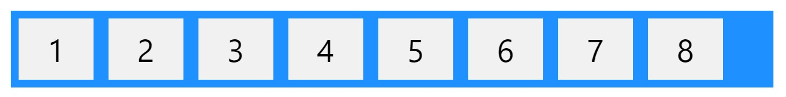

Before the Flexbox Layout module, there were four layout modes:

* Block, for sections in a webpage
* Inline, for text
* Table, for two-dimensional table data
* Positioned, for explicit position of an element

&#10147; The Flexible Box Layout Module, makes it easier to design flexible responsive layout structure without using float or positioning.

### Browser Support
The flexbox properties are supported in all modern browsers.

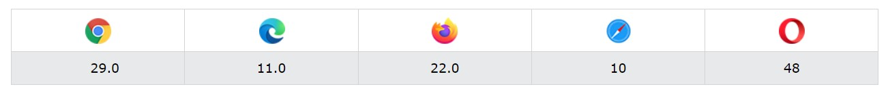

### Flexbox Elements

To start using the Flexbox model, you need to first define a flex container.

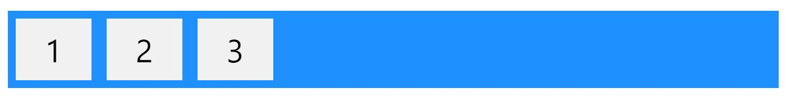

&#10147; The element above represents a flex container (the blue area) with three flex items.

## CSS Flex Container

The flex container becomes flexible by setting the `display` property to `flex`:

    .flex-container {
      display: flex;
    }

The flex container properties are:

- flex-direction
- flex-wrap
- flex-flow
- justify-content
- align-items
- align-content

## The flex-direction Property

The `flex-direction` property defines in which direction the container wants to stack the flex items.

#### Example
    The `column` value stacks the flex items vertically (from top to bottom):

        .flex-container {
          display: flex;
          flex-direction: column;
        }

#### Result:
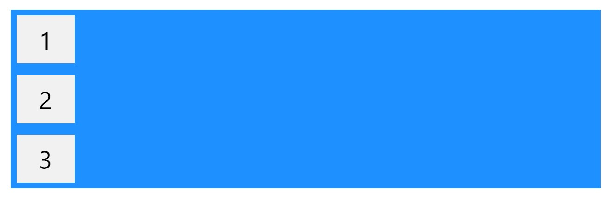

#### Example
    The `column-reverse` value stacks the flex items vertically (but from bottom to top):

        .flex-container {
          display: flex;
          flex-direction: column-reverse;
        }

#### Result:
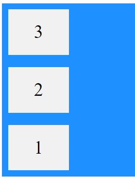

#### Example
    The `row` value stacks the flex items horizontally (from left to right):

        .flex-container {
          display: flex;
          flex-direction: row;
        }

#### Result:
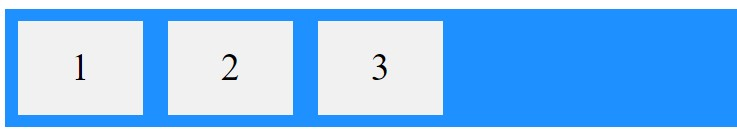

#### Example
    The `row-reverse` value stacks the flex items horizontally (but from right to left):

        .flex-container {
          display: flex;
          flex-direction: row-reverse;
        }

#### Result:
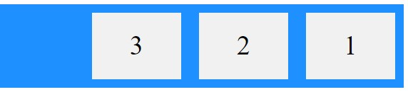

## The flex-wrap Property

&#10147; The `flex-wrap` property specifies whether the flex items should wrap or not.

#### Example
    The `wrap` value specifies that the flex items will wrap if necessary:

        .flex-container {
          display: flex;
          flex-wrap: wrap;
        }

#### Result:
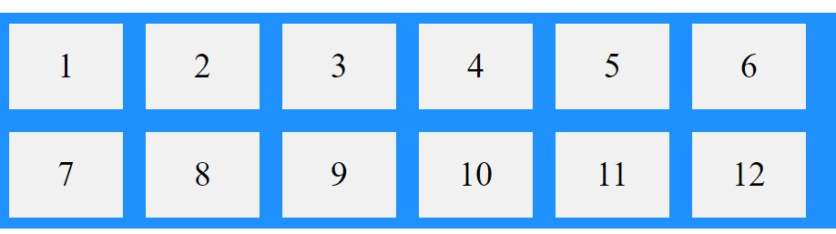

#### Example
    The `nowrap` value specifies that the flex items will not wrap (this is default):

        .flex-container {
          display: flex;
          flex-wrap: nowrap;
        }

#### Result:
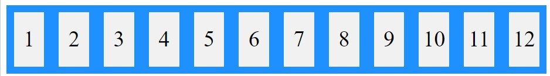

#### Example
    The `wrap-reverse` value specifies that the flexible items will wrap if necessary, in reverse order:

        .flex-container {
          display: flex;
          flex-wrap: wrap-reverse;
        }

#### Result:
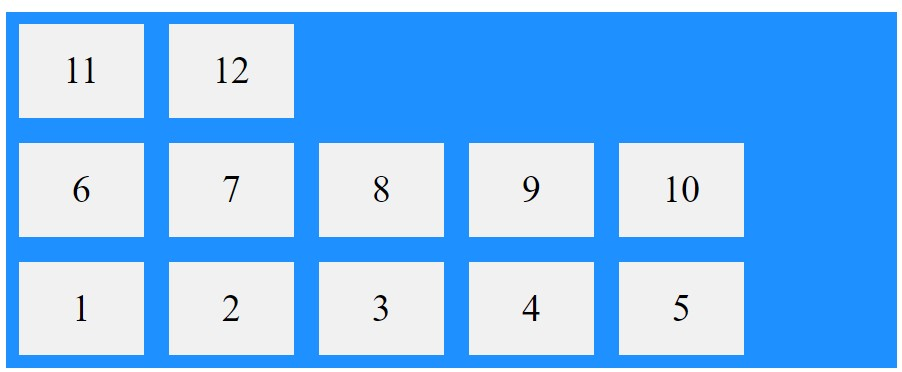

## The flex-flow Property

&#10147; The `flex-flow` property is a shorthand property for setting both the `flex-direction` and `flex-wrap` properties.

#### Example
    .flex-container {
      display: flex;
      flex-flow: row-reverse wrap-reverse;
    }

#### Result:
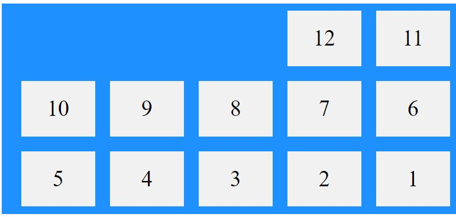

## The justify-content Property

&#10147; The `justify-content` property is used to align the flex items:

#### Example
    The `center` value aligns the flex items at the center of the container:

        .flex-container {
          display: flex;
          justify-content: center;
        }

#### Result:
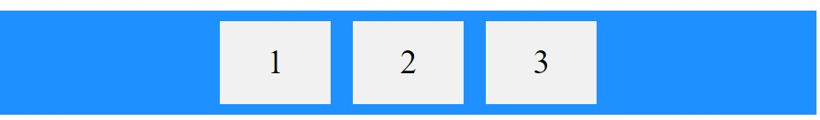

#### Example
    The `flex-start` value aligns the flex items at the beginning of the container (this is default):

        .flex-container {
          display: flex;
          justify-content: flex-start;
        }

#### Result:

#### Example
    The "flex-end" value aligns the flex items at the end of the container:

        .flex-container {
          display: flex;
          justify-content: flex-end;
        }

#### Result:
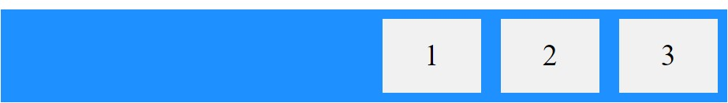

#### Example
    The "space-around" value displays the flex items with space before, between, and after the lines:

        .flex-container {
          display: flex;
          justify-content: space-around;
        }

#### Result:
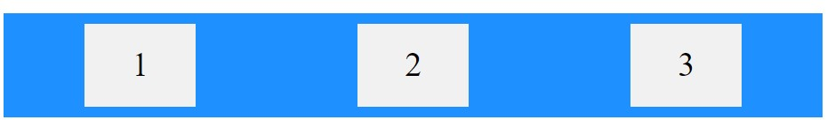

#### Example
    The "space-between" value displays the flex items with space between the lines:

        .flex-container {
          display: flex;
          justify-content: space-between;
        }

#### Result:
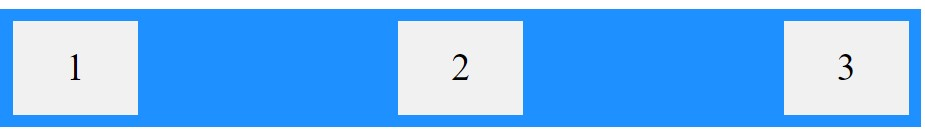

## The align-items Property

&#10147; The align-items property is used to align the flex items.

#### Example
    The "center" value aligns the flex items in the middle of the container:

        .flex-container {
          display: flex;
          height: 200px;
          align-items: center;
        }

#### Result:
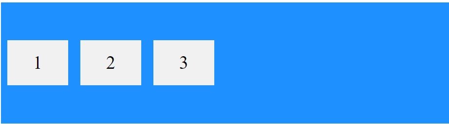

#### Example
    The "flex-start" value aligns the flex items at the top of the container:

        .flex-container {
          display: flex;
          height: 200px;
          align-items: flex-start;
        }

#### Result:
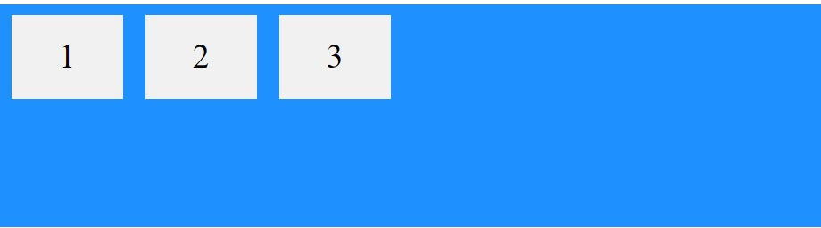

#### Example
    The "flex-end" value aligns the flex items at the bottom of the container:

        .flex-container {
          display: flex;
          height: 200px;
          align-items: flex-end;
        }

#### Result:
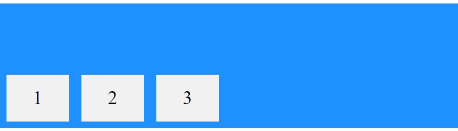

#### Example
    The "stretch" value stretches the flex items to fill the container (this is default):

        .flex-container {
          display: flex;
          height: 200px;
          align-items: stretch;
        }

#### Result:
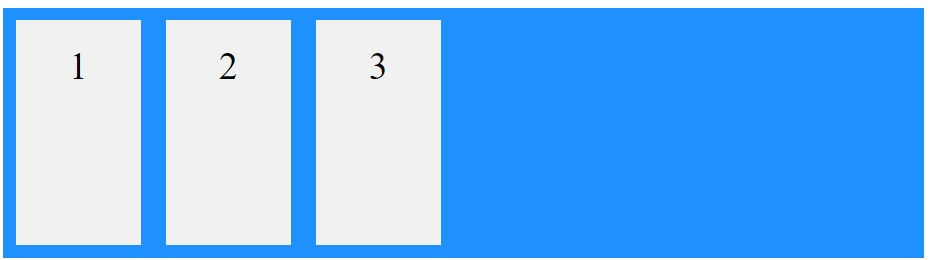

#### Example
    The "baseline" value aligns the flex items such as their baselines aligns:

        .flex-container {
          display: flex;
          height: 200px;
          align-items: baseline;
        }

#### Result:
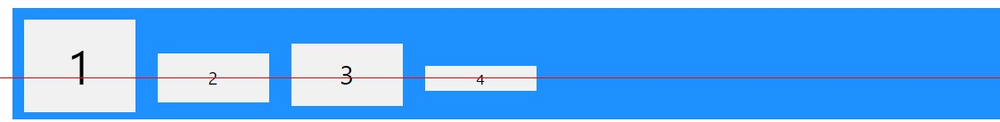

## The align-content Property

&#10147; The `align-content` property is used to align the flex lines.

#### Example
    The "space-between" value displays the flex lines with equal space between them:

        .flex-container {
          display: flex;
          height: 600px;
          flex-wrap: wrap;
          align-content: space-between;
        }

#### Result:
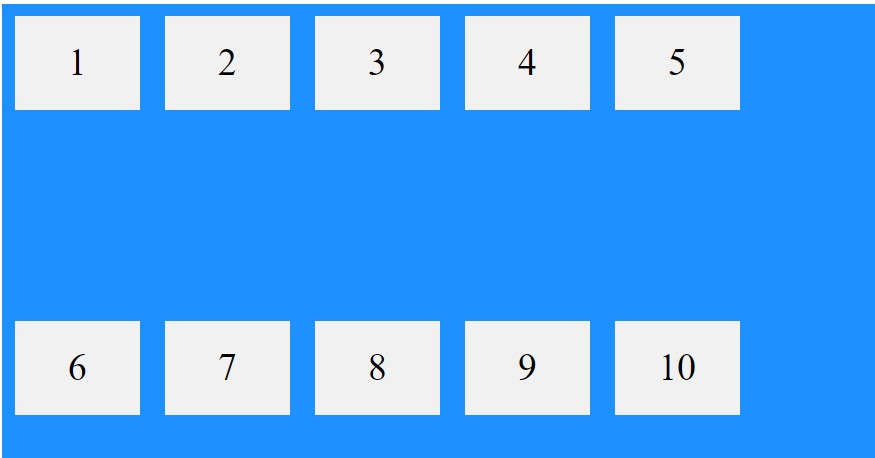

#### Example
    The "space-around" value displays the flex lines with space before, between, and after them:

        .flex-container {
          display: flex;
          height: 600px;
          flex-wrap: wrap;
          align-content: space-around;
        }

#### Result:
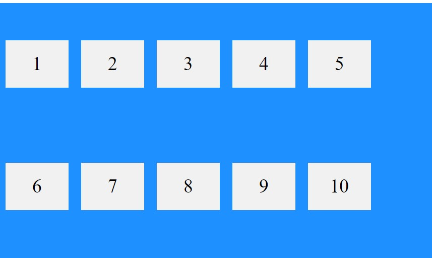

#### Example
    The "stretch" value stretches the flex lines to take up the remaining space (this is default):

        .flex-container {
          display: flex;
          height: 600px;
          flex-wrap: wrap;
          align-content: stretch;
        }

#### Result:
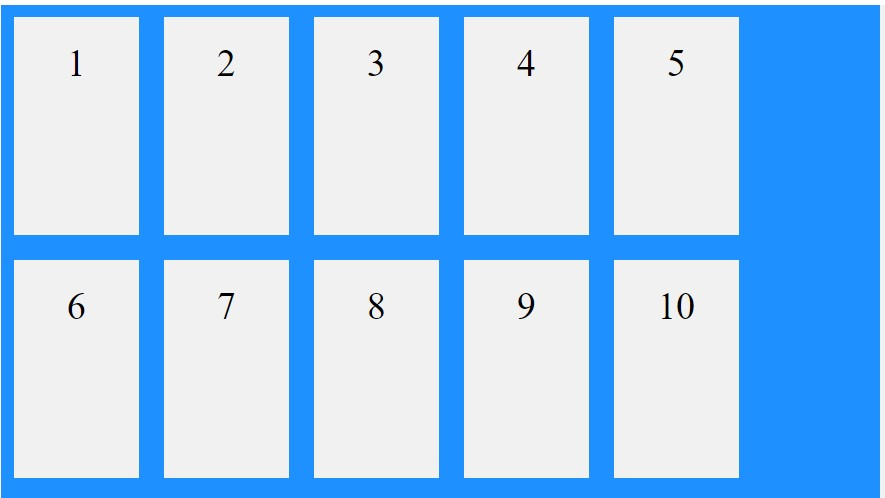

#### Example
    The "center" value displays display the flex lines in the middle of the container:

        .flex-container {
          display: flex;
          height: 600px;
          flex-wrap: wrap;
          align-content: center;
        }

#### Result:

#### Example
    The "flex-start" value displays the flex lines at the start of the container:

        .flex-container {
          display: flex;
          height: 600px;
          flex-wrap: wrap;
          align-content: flex-start;
        }

#### Result:
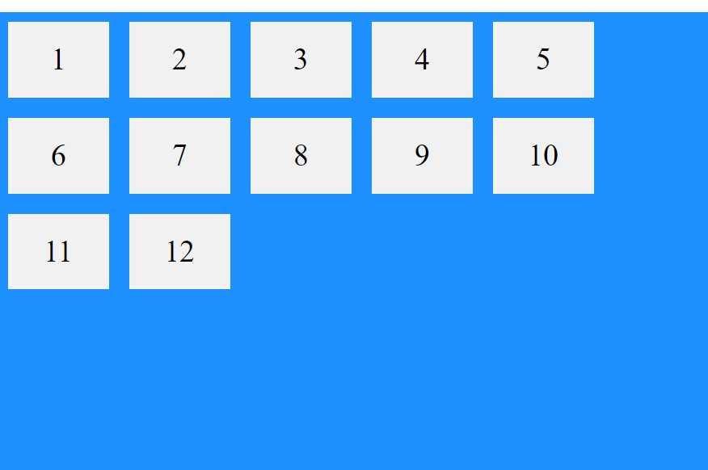

#### Example
    The "flex-end" value displays the flex lines at the end of the container: 

        .flex-container {
          display: flex;
          height: 600px;
          flex-wrap: wrap;
          align-content: flex-end;
        }

#### Result:
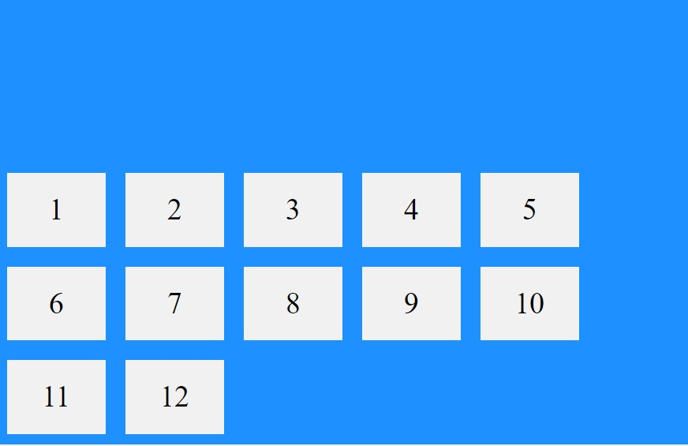

### Perfect Centering

&#10067; In the following example we will solve a very common style problem: perfect centering &#10067;

<b>SOLUTION:</b> Set both the `justify-content` and `align-items` properties to `center`, and the flex item will be perfectly centered:

#### To continue, go to the next page:  [Ders06](../../Ders06/)

## Example Website

