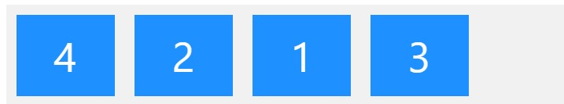
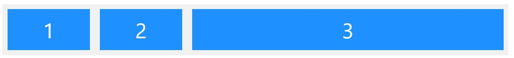
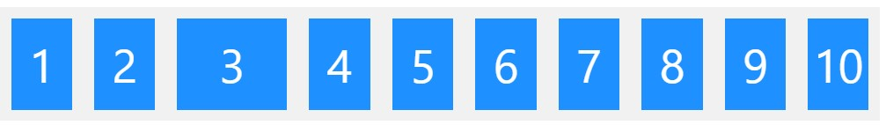
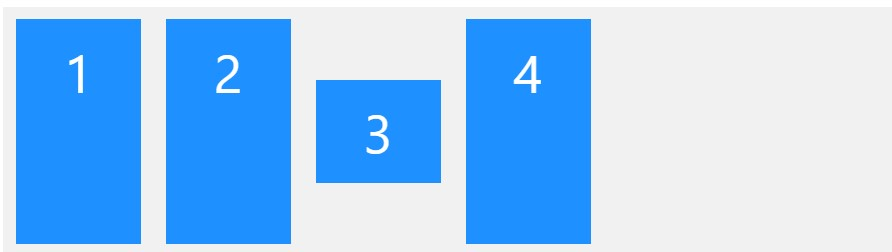
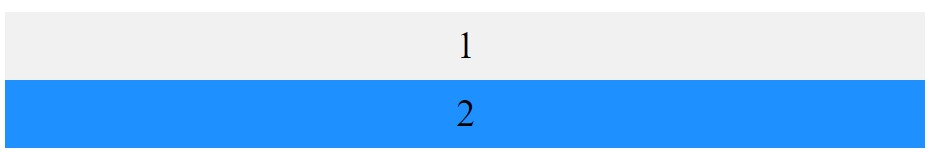

[Turn Back](../../)
<h1 align="center">Ders06 - CSS Flexbox</h1>

<h3 align="center">Languages and Tools:</h3>

  

# Introduction to CSS

## Contents:
 - [Categories](#categories)
      - [CSS Flex Items](#css-flex-items)
      - [The order Property](#the-order-property)
      - [The flex-grow Property](#the-flex-grow-property)
      - [The flex-shrink Property](#the-flex-shrink-property)
      - [The flex-basis Property](#the-flex-basis-property)
      - [The flex Property](#the-flex-property)
      - [The align-self Property](#the-align-self-property)
      - [CSS Flex Responsive](#css-flex-responsive)

## CSS Flex Items

### Child Elements (Items)
&#10147; The direct child elements of a flex container automatically becomes flexible (flex) items.

The flex item properties are:

- order
- flex-grow
- flex-shrink
- flex-basis
- flex
- align-self

## The order Property

&#10148; The `order` property specifies the order of the flex items.
&#10148; The `order` value must be a number, default value is 0.

##### Example
        The "order" property can change the order of the flex items:

                

                
1

                
2

                
3

                
4

                

#### Result:

## The flex-grow Property

&#10149; The `flex-grow` property specifies how much a flex item will grow relative to the rest of the flex items.
&#10071;&#10071;&#10071; The value must be a number, default value is 0.

#### Example
        Make the third flex item grow eight times faster than the other flex items:

                

                
1

                
2

                
3

                

#### Result:

## The flex-shrink Property

&#10150; The `flex-shrink` property specifies how much a flex item will shrink relative to the rest of the flex items.
&#10071;&#10071;&#10071; The value must be a number, default value is 1.

#### Example
        Do not let the third flex item shrink as much as the other flex items:

                

                
1

                
2

                
3

                
4

                
5

                
6

                
7

                
8

                
9

                
10

                

#### Result:

## The flex-basis Property

&#10151; The `flex-basis` property specifies the initial length of a flex item.

#### Example
        Set the initial length of the third flex item to 200 pixels:

                

                
1

                
2

                
3

                
4

                

#### Result:

## The flex Property

&#10152; The `flex` property is a shorthand property for the `flex-grow`, `flex-shrink`, and `flex-basis` properties.

#### Example
        Make the third flex item not growable (0), not shrinkable (0), and with an initial length of 200 pixels:

                

                
1

                
2

                
3

                
4

                

#### Result:

## The align-self Property

&#10163; The `align-self` property specifies the alignment for the selected item inside the flexible container.

&#10071;&#10071;&#10071; The `align-self` property overrides the default alignment set by the container's `align-items` property.

#### Example
        Align the third flex item in the middle of the container:

                

                
1

                
2

                
3

                
4

                

#### Result:

## CSS Flex Responsive

&#10164; For example, if you want to create a two-column layout for most screen sizes, and a one-column layout for small screen sizes (such as phones and tablets), you can change the `flex-direction` from `row` to `column` at a specific breakpoint

#### Example
        .flex-container {
        display: flex;
        flex-direction: row;
        }

        /* Responsive layout - makes a one column layout instead of a two-column layout */
        @media (max-width: 800px) {
        .flex-container {
            flex-direction: column;
        }
        }

#### width > 800px to Result:  

#### width < 800px to Result:

&#10071;&#10071;&#10071; Another way is to change the percentage of the `flex` property of the flex items to create different layouts for different screen sizes. Note that we also have to include `flex-wrap: wrap;` on the flex container for this example to work:

        .flex-container {
        display: flex;
        flex-wrap: wrap;
        }

        .flex-item-left {
        flex: 50%;
        }

        .flex-item-right {
        flex: 50%;
        }

        /* Responsive layout - makes a one column layout instead of a two-column layout */
        @media (max-width: 800px) {
        .flex-item-right, .flex-item-left {
            flex: 100%;
        }
        }

