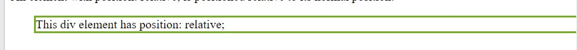
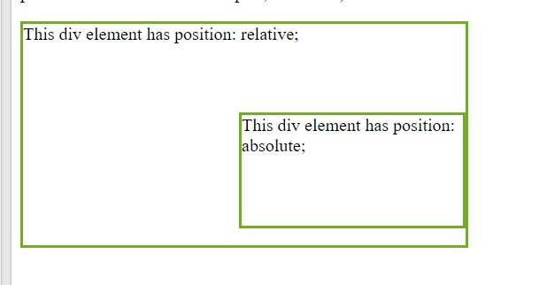

[Turn Back](../../)

<h1 align="center">Ders08 - Position Property</h1>

<h3 align="center">Languages and Tools:</h3>

  

# Introduction to CSS

## The position Property

&#10147; The position property specifies the type of positioning method used for an element.

&#10147; There are five different position values:

- `static`
- `relative`
- `fixed`
- `absolute`
- `sticky`

<b>Note</b>&#10071; Elements are then positioned using the top, bottom, left, and right properties. However, these properties will not work unless the `position` property is set first. They also work differently depending on the position value.

### position: static;

&#10148; HTML elements are positioned static by default.

&#10148; Static positioned elements are not affected by the top, bottom, left, and right properties.

&#10148; An element with `position: static`; is not positioned in any special way; it is always positioned according to the normal flow of the page:

### position: relative;

&#10149; An element with `position: relative`; is positioned relative to its normal position.

&#10149; Setting the top, right, bottom, and left properties of a relatively-positioned element will cause it to be adjusted away from its normal position. Other content will not be adjusted to fit into any gap left by the element.

#### Example

        

        

          This div element has position: relative;
        

#### Result:

### position: fixed;

&#10150; An element with `position: fixed`; is positioned relative to the viewport, which means it always stays in the same place even if the page is scrolled. The top, right, bottom, and left properties are used to position the element.

&#10150; A fixed element does not leave a gap in the page where it would normally have been located.

### position: absolute;

&#10151; An element with `position: absolute`; is positioned relative to the nearest positioned ancestor (instead of positioned relative to the viewport, like fixed).

&#10151; However; if an absolute positioned element has no positioned ancestors, it uses the document body, and moves along with page scrolling.

<b>Note</b>&#10071; Absolute positioned elements are removed from the normal flow, and can overlap elements.

#### Example

        div.relative {
          position: relative;
          width: 400px;
          height: 200px;
          border: 3px solid #73AD21;
        }

        div.absolute {
          position: absolute;
          top: 80px;
          right: 0;
          width: 200px;
          height: 100px;
          border: 3px solid #73AD21;
        }

#### Result:

### position: sticky;

&#10152; An element with position: sticky; is positioned based on the user's scroll position.

&#10152; A sticky element toggles between relative and fixed, depending on the scroll position. It is positioned relative until a given offset position is met in the viewport - then it "sticks" in place (like position:fixed).