[Turn Back](../../../)
<h1 align="center">Ders05 - CSS Grid Layout</h1>

<h3 align="center">Languages and Tools:</h3>

  

# Introduction to CSS

## Contents:
 - [Categories](#categories)
      - [Grid Layout](#grid-layout)
      - [Grid Columns](#grid-columns)
      - [Grid Rows](#grid-rows)
      - [Grid Lines](#grid-lines)
      - [All CSS Grid Properties](#all-css-grid-properties)
      - [CSS Grid Container](#css-grid-container)
      - [CSS Grid Item](#css-grid-item)
      - [Example Website](#example-website)

## Grid Layout

&#10147; The CSS Grid Layout Module offers a grid-based layout system, with rows and columns, making it easier to design web pages without having to use floats and positioning.

### Browser Support

The grid properties are supported in all modern browsers.
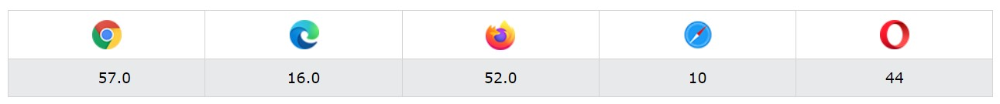

## Grid Elements

&#10148; A grid layout consists of a parent element, with one or more child elements.

#### Example

    
    

      
1

      
2

      
3

      
4

      
5

      
6

      
7

      
8

      
9

    

### Result:
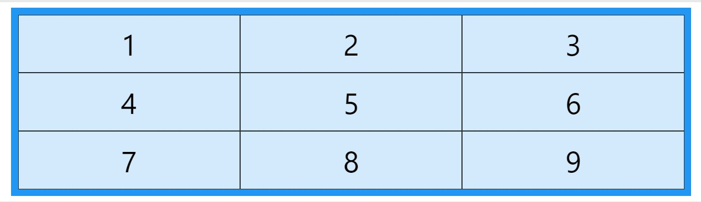

### Display Property

&#10149; An HTML element becomes a grid container when its `display` property is set to `grid` or `inline-grid`.

    .grid-container {        
      display: grid;
    }

    .grid-container {
      display: inline-grid;
    }
&#10071; All direct children of the grid container automatically become grid items.

## Grid Columns

&#10150; The vertical lines of grid items are called columns.

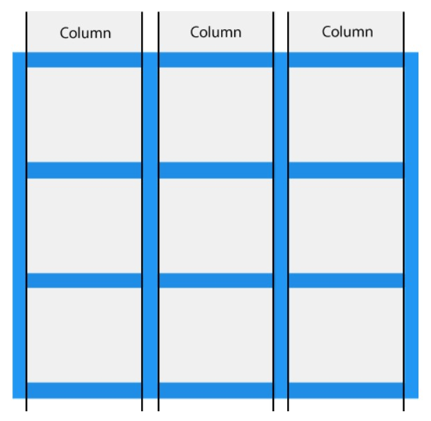

## Grid Rows

&#10150; The horizontal lines of grid items are called rows.

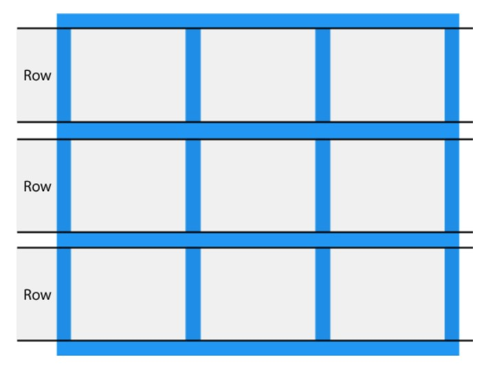

## Grid Gaps

&#10150; The spaces between each column/row are called gaps.

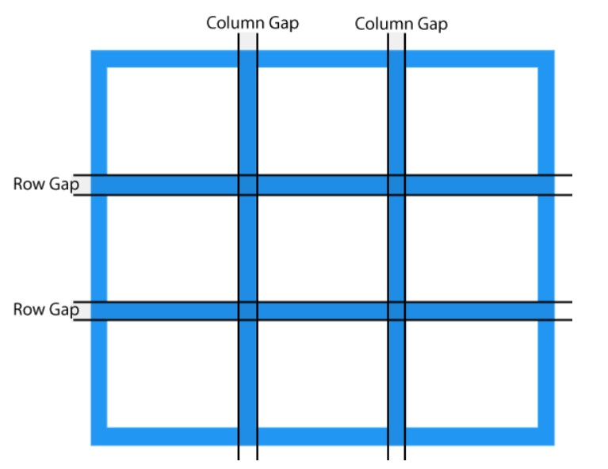

## Grid Lines

&#10150; The lines between columns are called column lines.

&#10150; The lines between rows are called row lines

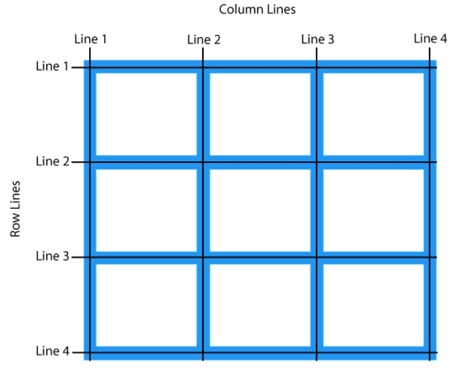
&#10071; Refer to line numbers when placing a grid item in a grid container:

### Example
    Place a grid item at column line 1, and let it end on column line 3:
        .grid-container {
          display: grid;
          grid-template-columns: auto auto auto;
          gap: 10px;
          background-color: #2196F3;
          padding: 10px;
        }

        .grid-container > div {
          background-color: rgba(255, 255, 255, 0.8);
          text-align: center;
          padding: 20px 0;
          font-size: 30px;
        }

        .item1 {
          grid-column-start: 1;
          grid-column-end: 3;
        }

### Result:
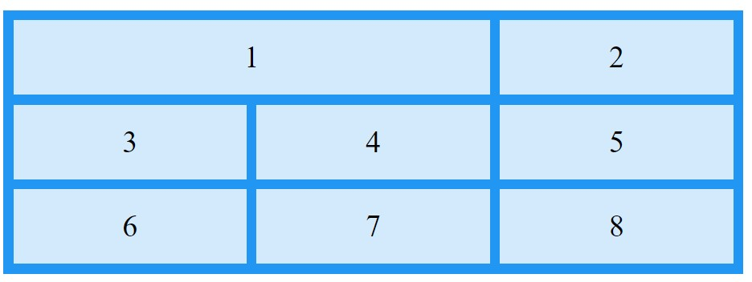

### Example
    Place a grid item at row line 1, and let it end on row line 3:

        .item1 {
          grid-row-start: 1;
          grid-row-end: 3;
        }

### Result:

## All CSS Grid Properties

<table>
  <tbody><tr>
    <th>Property</th>
    <th>Description</th>
  </tr>
  <tr>
    <td><a href="https://www.w3schools.com/cssref/css3_pr_column-gap.php">column-gap</a></td>
    <td>Specifies the gap between the columns</td>
  </tr>
  <tr>
    <td><a href="https://www.w3schools.com/cssref/css3_pr_gap.php">gap</a></td>
    <td>A shorthand property for the <em>row-gap</em> and the <em>column-gap</em> properties</td>
  </tr>
  <tr>
    <td><a href="https://www.w3schools.com/cssref/pr_grid.php">grid</a></td>
    <td>A shorthand property for the <em>grid-template-rows, 
    grid-template-columns, grid-template-areas, grid-auto-rows, 
    grid-auto-columns</em>, and the <em>grid-auto-flow</em> properties</td>
  </tr>
  <tr>
    <td><a href="https://www.w3schools.com/cssref/pr_grid-area.php">grid-area</a></td>
    <td>Either specifies a name for the grid item, or this property is a shorthand property for the <em>grid-row-start</em>, <em>grid-column-start</em>, <em>grid-row-end</em>, and <em>grid-column-end</em> properties</td>
  </tr>
  <tr>
    <td><a href="https://www.w3schools.com/cssref/pr_grid-auto-columns.php">grid-auto-columns</a></td>
    <td>Specifies a default column size</td>
  </tr>
  <tr>
    <td><a href="https://www.w3schools.com/cssref/pr_grid-auto-flow.php">grid-auto-flow</a></td>
    <td>Specifies how auto-placed items are inserted in the grid</td>
  </tr>
  <tr>
    <td><a href="https://www.w3schools.com/cssref/pr_grid-auto-rows.php">grid-auto-rows</a></td>
    <td>Specifies a default row size</td>
  </tr>
  <tr>
    <td><a href="https://www.w3schools.com/cssref/pr_grid-column.php">grid-column</a></td>
    <td>A shorthand property for the <em>grid-column-start</em> and the <em>grid-column-end</em> properties</td>
  </tr>
  <tr>
    <td><a href="https://www.w3schools.com/cssref/pr_grid-column-end.php">grid-column-end</a></td>
    <td>Specifies where to end the grid item</td>
  </tr>
  <tr>
    <td><a href="https://www.w3schools.com/cssref/pr_grid-column-gap.php">grid-column-gap</a></td>
    <td>Specifies the size of the gap between columns</td>
  </tr>
  <tr>
    <td><a href="https://www.w3schools.com/cssref/pr_grid-column-start.php">grid-column-start</a></td>
    <td>Specifies where to start the grid item</td>
  </tr>
  <tr>
    <td><a href="https://www.w3schools.com/cssref/pr_grid-gap.php">grid-gap</a></td>
    <td>A shorthand property for the <em>grid-row-gap</em> and <em>grid-column-gap</em> properties</td>
  </tr>
  <tr>
    <td><a href="https://www.w3schools.com/cssref/pr_grid-row.php">grid-row</a></td>
    <td>A shorthand property for the <em>grid-row-start</em> and the <em>grid-row-end</em> properties</td>
  </tr>
  <tr>
    <td><a href="https://www.w3schools.com/cssref/pr_grid-row-end.php">grid-row-end</a></td>
    <td>Specifies where to end the grid item</td>
  </tr>
  <tr>
    <td><a href="https://www.w3schools.com/cssref/pr_grid-row-gap.php">grid-row-gap</a></td>
    <td>Specifies the size of the gap between rows</td>
  </tr>
  <tr>
    <td><a href="https://www.w3schools.com/cssref/pr_grid-row-start.php">grid-row-start</a></td>
    <td>Specifies where to start the grid item</td>
  </tr>
  <tr>
    <td><a href="https://www.w3schools.com/cssref/pr_grid-template.php">grid-template</a></td>
    <td>A shorthand property for the <em>grid-template-rows</em>, <em>grid-template-columns</em> 
    and <em>grid-areas</em> properties</td>
  </tr>
  <tr>
    <td><a href="https://www.w3schools.com/cssref/pr_grid-template-areas.php">grid-template-areas</a></td>
    <td>Specifies how to display columns and rows, using named grid items</td>
  </tr>
  <tr>
    <td><a href="https://www.w3schools.com/cssref/pr_grid-template-columns.php">grid-template-columns</a></td>
    <td>Specifies the size of the columns, and how many columns in a grid layout</td>
  </tr>
  <tr>
    <td><a href="https://www.w3schools.com/cssref/pr_grid-template-rows.php">grid-template-rows</a></td>
    <td>Specifies the size of the rows in a grid layout</td>
  </tr>
  <tr>
    <td><a href="https://www.w3schools.com/cssref/css3_pr_row-gap.php">row-gap</a></td>
    <td>Specifies the gap between the grid rows</td>
  </tr>
</tbody></table>

## CSS Grid Container

&#10151; To make an HTML element behave as a grid container, you have to set the `display` property to `grid` or `inline-grid`.

&#10151; Grid containers consist of grid items, placed inside columns and rows.

### The grid-template-columns Property

&#10152; The `grid-template-columns` property defines the number of columns in your grid layout, and it can define the width of each column.

&#10152; The value is a space-separated-list, where each value defines the width of the respective column.

&#10152; If you want your grid layout to contain 4 columns, specify the width of the 4 columns, or "auto" if all columns should have the same width.

<b>Note</b>&#10071; If you have more than 4 items in a 4 columns grid, the grid will automatically add a new row to put the items in.

&#10152; The `grid-template-columns` property can also be used to specify the size (width) of the columns.

### Example
    Set a size for the 4 columns:
        .grid-container {
          display: grid;
          grid-template-columns: 80px 200px auto 30px;
          gap: 10px;
          background-color: #2196F3;
          padding: 10px;
        }

        .grid-container > div {
          background-color: rgba(255, 255, 255, 0.8);
          text-align: center;
          padding: 20px 0;
          font-size: 30px;
        }

### Result:
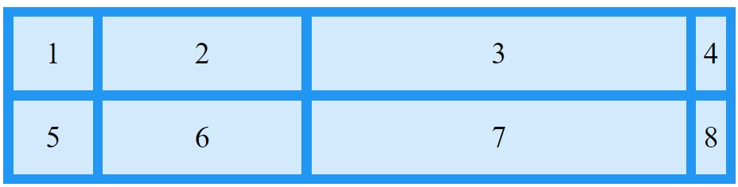

### The grid-template-rows Property

&#10153; The `grid-template-rows` property defines the height of each row.

### Example
    .grid-container {
      display: grid;
      grid-template-columns: auto auto auto;
      grid-template-rows: 80px 200px;
      gap: 10px;
      background-color: #2196F3;
      padding: 10px;
    }

    .grid-container > div {
      background-color: rgba(255, 255, 255, 0.8);
      text-align: center;
      padding: 20px 0;
      font-size: 30px;
    }

### Result:
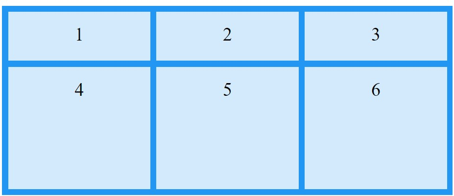

### The justify-content Property

&#10154; The `justify-content` property is used to align the whole grid inside the container.

<b>Note</b>&#10071; The grid's total width has to be less than the container's width for the `justify-content` property to have any effect.

### Example
    .grid-container {
      display: grid;
      justify-content: space-evenly;
      grid-template-columns: 50px 50px 50px; /*Make the grid smaller than the container*/
      gap: 10px;
      background-color: #2196F3;
      padding: 10px;
    }

    .grid-container > div {
      background-color: rgba(255, 255, 255, 0.8);
      text-align: center;
      padding: 20px 0;
      font-size: 30px;
    }

### Result:
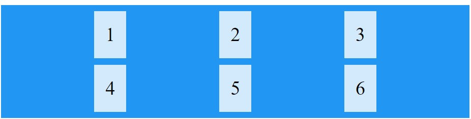

### Example
    .grid-container {
      display: grid;
      justify-content: space-around;
      grid-template-columns: 50px 50px 50px; /*Make the grid smaller than the container*/
      gap: 10px;
      background-color: #2196F3;
      padding: 10px;
    }

    .grid-container > div {
      background-color: rgba(255, 255, 255, 0.8);
      text-align: center;
      padding: 20px 0;
      font-size: 30px;
    }

### Result:
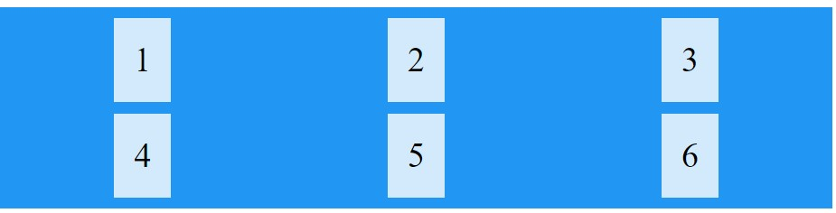

### Example
    .grid-container {
      display: grid;
      justify-content: space-between;
      grid-template-columns: 50px 50px 50px; /*Make the grid smaller than the container*/
      gap: 10px;
      background-color: #2196F3;
      padding: 10px;
    }

    .grid-container > div {
      background-color: rgba(255, 255, 255, 0.8);
      text-align: center;
      padding: 20px 0;
      font-size: 30px;
    }

### Result:
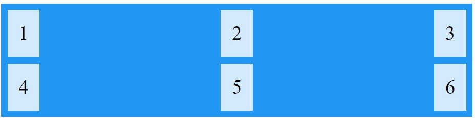

### Example
    .grid-container {
      display: grid;
      justify-content: start;
      grid-template-columns: 50px 50px 50px; /*Make the grid smaller than the container*/
      gap: 10px;
      background-color: #2196F3;
      padding: 10px;
    }

    .grid-container > div {
      background-color: rgba(255, 255, 255, 0.8);
      text-align: center;
      padding: 20px 0;
      font-size: 30px;
    }

### Result:
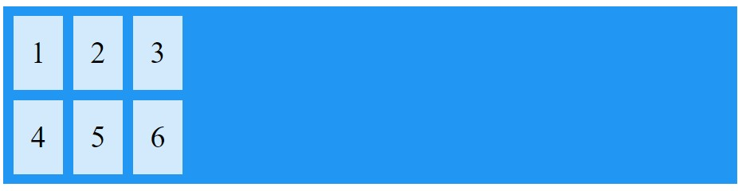

### Example
    .grid-container {
      display: grid;
      justify-content: end;
      grid-template-columns: 50px 50px 50px; /*Make the grid smaller than the container*/
      gap: 10px;
      background-color: #2196F3;
      padding: 10px;
    }

    .grid-container > div {
      background-color: rgba(255, 255, 255, 0.8);
      text-align: center;
      padding: 20px 0;
      font-size: 30px;
    }

### Result:

### The align-content Property

&#10159; The `align-content` property is used to vertically align the whole grid inside the container.

<b>Note</b>&#10071; The grid's total height has to be less than the container's height for the `align-content` property to have any effect.

### Example
    .grid-container {
      display: grid;
      height: 400px;
      align-content: center;
      grid-template-columns: auto auto auto;
      gap: 10px;
      background-color: #2196F3;
      padding: 10px;
    }

    .grid-container > div {
      background-color: rgba(255, 255, 255, 0.8);
      text-align: center;
      padding: 20px 0;
      font-size: 30px;
    }

### Result:
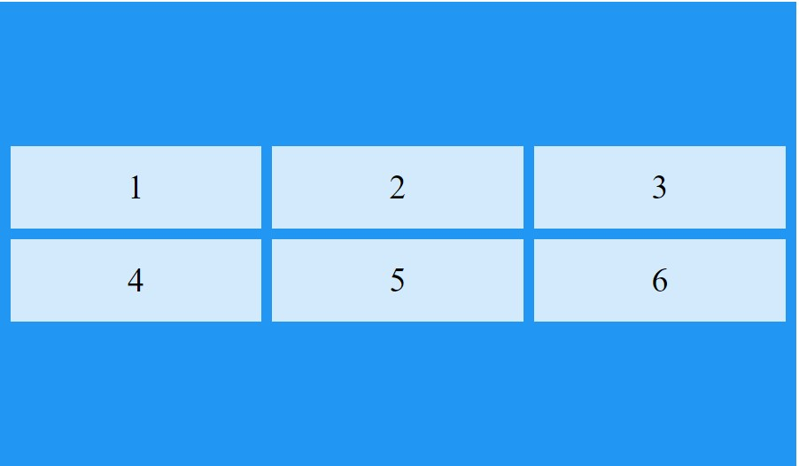

### Example
    .grid-container {
      display: grid;
      height: 400px;
      align-content: space-evenly;
      grid-template-columns: auto auto auto;
      gap: 10px;
      background-color: #2196F3;
      padding: 10px;
    }

    .grid-container > div {
      background-color: rgba(255, 255, 255, 0.8);
      text-align: center;
      padding: 20px 0;
      font-size: 30px;
    }

### Result:
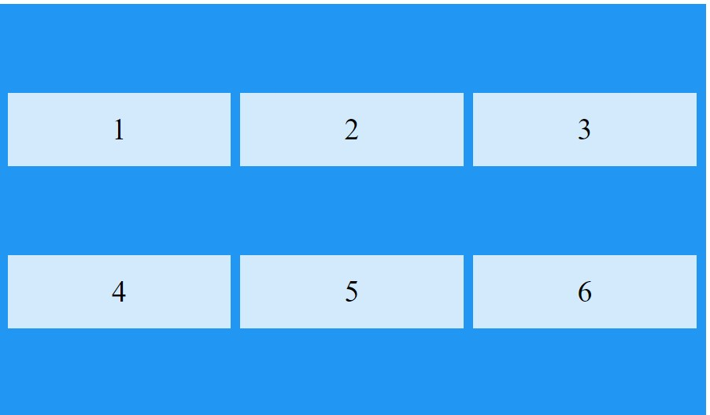

### Example
    .grid-container {
      display: grid;
      height: 400px;
      align-content: space-around;
      grid-template-columns: auto auto auto;
      gap: 10px;
      background-color: #2196F3;
      padding: 10px;
    }

    .grid-container > div {
      background-color: rgba(255, 255, 255, 0.8);
      text-align: center;
      padding: 20px 0;
      font-size: 30px;
    }

### Result:
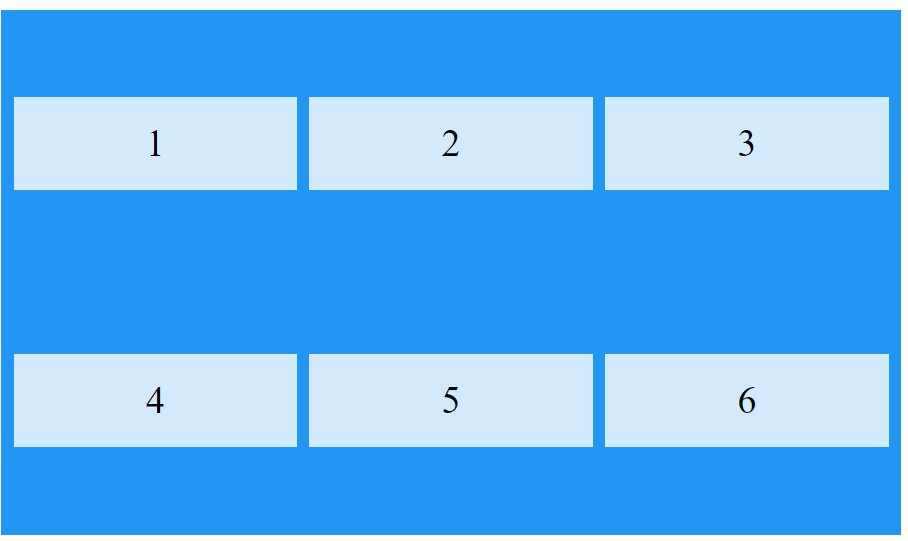

### Example
    .grid-container {
      display: grid;
      height: 400px;
      align-content: space-between;
      grid-template-columns: auto auto auto;
      gap: 10px;
      background-color: #2196F3;
      padding: 10px;
    }

    .grid-container > div {
      background-color: rgba(255, 255, 255, 0.8);
      text-align: center;
      padding: 20px 0;
      font-size: 30px;
    }

### Result:
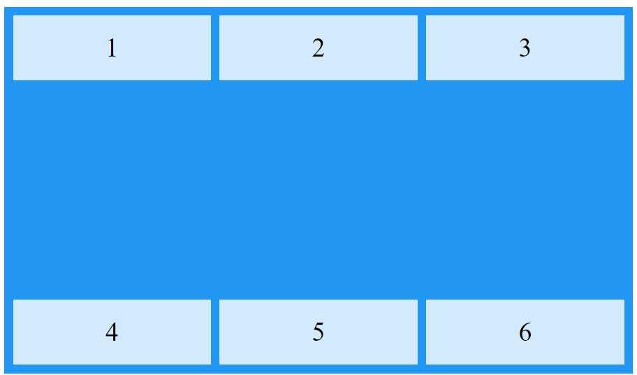

### Example
    .grid-container {
      display: grid;
      height: 400px;
      align-content: start;
      grid-template-columns: auto auto auto;
      gap: 10px;
      background-color: #2196F3;
      padding: 10px;
    }

    .grid-container > div {
      background-color: rgba(255, 255, 255, 0.8);
      text-align: center;
      padding: 20px 0;
      font-size: 30px;
    }

### Result:
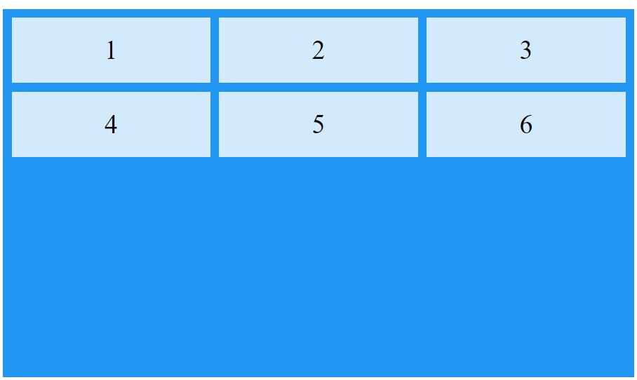

### Example
    .grid-container {
      display: grid;
      height: 400px;
      align-content: end;
      grid-template-columns: auto auto auto;
      gap: 10px;
      background-color: #2196F3;
      padding: 10px;
    }

    .grid-container > div {
      background-color: rgba(255, 255, 255, 0.8);
      text-align: center;
      padding: 20px 0;
      font-size: 30px;
    }

### Result:
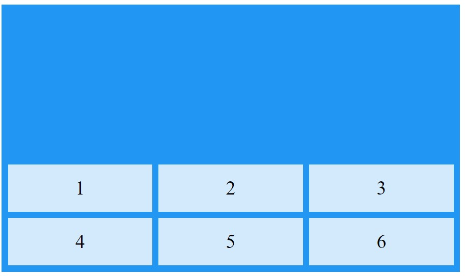

## CSS Grid Item

&#10161; A grid container contains grid items.

&#10161; By default, a container has one grid item for each column, in each row, but you can style the grid items so that they will span multiple columns and/or rows.

### The grid-column Property:

&#10162; The `grid-column` property defines on which column(s) to place an item.

&#10162; You define where the item will start, and where the item will end.

<b>Note</b>&#10071; The `grid-column` property is a shorthand property for the `grid-column-start` and the `grid-column-end` properties.

&#10162; To place an item, you can refer to line numbers, or use the keyword "span" to define how many columns the item will span.

### Example
    Make "item1" start on column 1 and end before column 5:

        grid-container {
          display: grid;
          grid-template-columns: auto auto auto auto auto auto;
          gap: 10px;
          background-color: #2196F3;
          padding: 10px;
        }

        .grid-container > div {
          background-color: rgba(255, 255, 255, 0.8);
          text-align: center;
          padding: 20px 0;
          font-size: 30px;
        }
        .item1 {
          grid-column: 1 / 5;
        }

### Result:
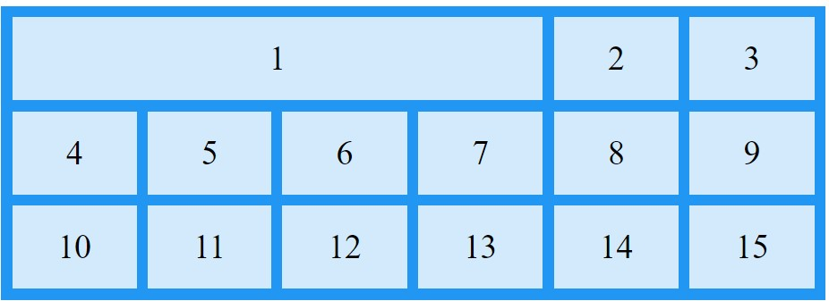

### Example
    Make "item1" start on column 1 and span 4 columns:
        grid-container {
          display: grid;
          grid-template-columns: auto auto auto auto auto auto;
          gap: 10px;
          background-color: #2196F3;
          padding: 10px;
        }

        .grid-container > div {
          background-color: rgba(255, 255, 255, 0.8);
          text-align: center;
          padding: 20px 0;
          font-size: 30px;
        }
        .item1 {
          grid-column: 1 / span 4;
        }

### Result:

### The grid-row Property:

&#10163; The `grid-row `property defines on which row to place an item.

&#10163; You define where the item will start, and where the item will end.

<b>Note</b>&#10071; The `grid-row` property is a shorthand property for the `grid-row-start` and the `grid-row-end` properties.

&#10163; To place an item, you can refer to line numbers, or use the keyword "span" to define how many rows the item will span:

### Example
    Make "item1" start on row-line 1 and end on row-line 4:

        .grid-container {
          display: grid;
          grid-template-columns: auto auto auto auto auto auto;
          gap: 10px;
          background-color: #2196F3;
          padding: 10px;
        }

        .grid-container > div {
          background-color: rgba(255, 255, 255, 0.8);
          text-align: center;
          padding: 20px 0;
          font-size: 30px;
        }
        .item1 {
          grid-row: 1 / 4;
        }

### Result:
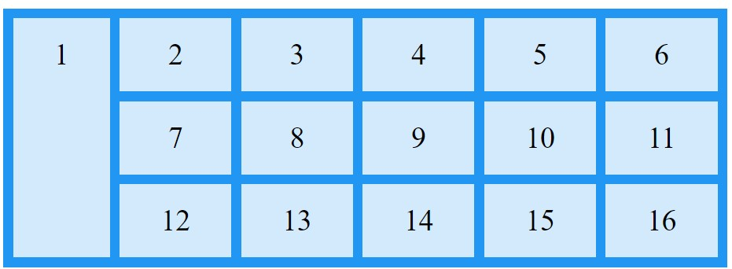

### Example
    Make "item1" start on row 1 and span 3 rows:

        .grid-container {
          display: grid;
          grid-template-columns: auto auto auto auto auto auto;
          gap: 10px;
          background-color: #2196F3;
          padding: 10px;
        }

        .grid-container > div {
          background-color: rgba(255, 255, 255, 0.8);
          text-align: center;
          padding: 20px 0;
          font-size: 30px;
        }
        .item1 {
          grid-row: 1 / span 2;
        }

### Result:

## Example Website

