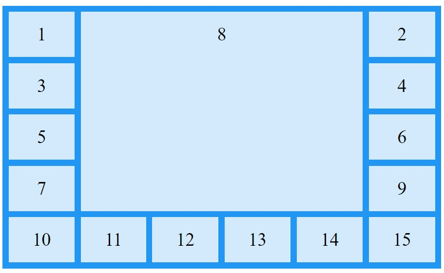
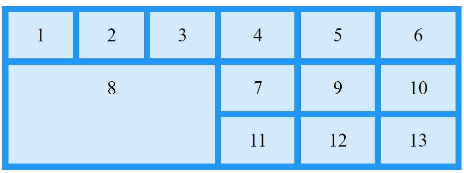
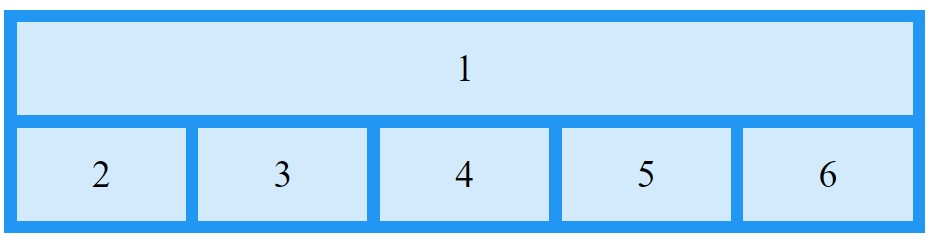
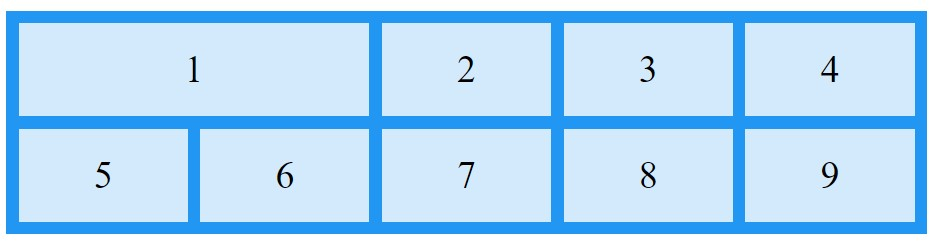
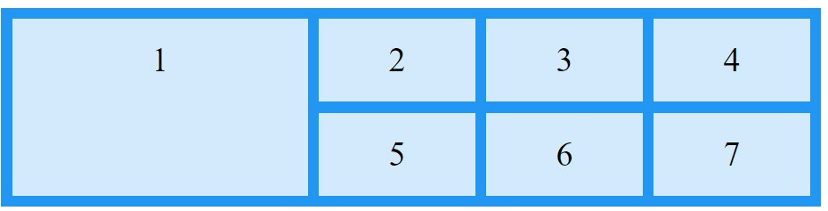
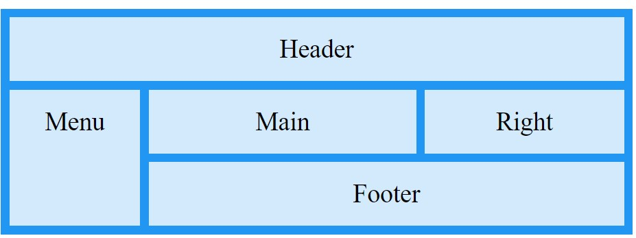
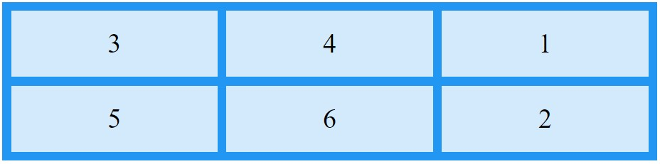

[Turn Back](../../../)
<h1 align="center">Ders05 - CSS Grid Area</h1>

<h3 align="center">Languages and Tools:</h3>

  

# Introduction to CSS

## Contents:
 - [Categories](#categories)
      - [Grid Area](#grid-area)
      - [Naming Grid Items](#naming-grid-items)
      - [The Order of the Items](#the-order-of-the-items)
      - [Example Website](#example-website)

## Grid Area

&#10147; The `grid-area` property can be used as a shorthand property for the `grid-row-start`, `grid-column-start`, `grid-row-end` and the `grid-column-end` properties.

### Example
    Make "item8" start on row-line 1 and column-line 2, and end on row-line 5 and column line 6:
        
        

          
1

          
2

          
3

          
4

          
5

          
6

          
7

          
8

          
9

          
10

          
11

          
12

          
13

          
14

          
15

        

### Result:

### Example
    Make "item8" start on row-line 2 and column-line 1, and span 2 rows and 3 columns:

        .item8 {
          grid-area: 2 / 1 / span 2 / span 3;
        }

### Result:

## Naming Grid Items

&#10150; The `grid-area` property can also be used to assign names to grid items..
&#10150; Named grid items can be referred to by the `grid-template-areas` property of the grid container.

### Example
    Item1 gets the name "myArea" and spans all five columns in a five columns grid layout:

        .item1 {
          grid-area: myArea;
        }
        .grid-container {
          grid-template-areas: 'myArea myArea myArea myArea myArea';
        }

### Result:

<b>Note</b>&#10071; Each row is defined by apostrophes (' ')

<b>Note</b>&#10071; The columns in each row is defined inside the apostrophes, separated by a space.
<b>Note</b>&#10071; A period sign represents a grid item with no name.

### Example
    Let "myArea" span two columns in a five columns grid layout (period signs represent items with no name):

        .item1 {
          grid-area: myArea;
        }
        .grid-container {
          grid-template-areas: 'myArea myArea . . .';
        }

### Result:

&#10151; To define two rows, define the column of the second row inside another set of apostrophes:

### Example
    Make "item1" span two columns and two rows:

      .grid-container {
        grid-template-areas: 'myArea myArea . . .' 'myArea myArea . . .';
      }

### Result:

### Example
    Name all items, and make a ready-to-use webpage template:

      .item1 { grid-area: header; }
      .item2 { grid-area: menu; }
      .item3 { grid-area: main; }
      .item4 { grid-area: right; }
      .item5 { grid-area: footer; }

      .grid-container {
        grid-template-areas:
          'header header header header header header'
          'menu main main main right right'
          'menu footer footer footer footer footer';
      } 

### Result:

## The Order of the Items

&#10152; The Grid Layout allows us to position the items anywhere we like.

<b>Note</b>&#10071; The first item in the HTML code does not have to appear as the first item in the grid.

### Example
    .grid-container {
      display: grid;
      grid-template-columns: auto auto auto;
      gap: 10px;
      background-color: #2196F3;
      padding: 10px;
    }

    .grid-container > div {
      background-color: rgba(255, 255, 255, 0.8);
      text-align: center;
      padding: 20px 0;
      font-size: 30px;
    }

    .item1 { grid-area: 1 / 3 / 2 / 4; }
    .item2 { grid-area: 2 / 3 / 3 / 4; }
    .item3 { grid-area: 1 / 1 / 2 / 2; }
    .item4 { grid-area: 1 / 2 / 2 / 3; }
    .item5 { grid-area: 2 / 1 / 3 / 2; }
    .item6 { grid-area: 2 / 2 / 3 / 3; }

### Result:

## Example Website

