[Turn Back](../../../)
<h1 align="center">Ders10 - CSS Transforms</h1>

<h3 align="center">Languages and Tools:</h3>

  

# Introduction to CSS

## Contents:
 - [Categories](#categories)
      - [CSS 2D Transforms](#css-2d-transforms)
      - [CSS 3D Transforms](#css-3d-transforms)
      - [Example Website](#example-website)

## CSS 2D Transforms

&#10147; CSS transforms allow you to move, rotate, scale, and skew elements.

### Browser Support

The numbers in the table specify the first browser version that fully supports the property.
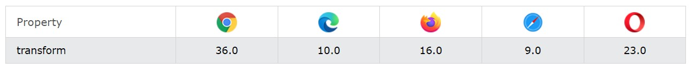

&#10147; With the CSS `transform` property you can use the following 2D transformation methods:

- translate()
- rotate()
- scaleX()
- scaleY()
- scale()
- skewX()
- skewY()
- skew()
- matrix()

### The translate() Method

&#10148; The `translate()` method moves an element from its current position (according to the parameters given for the X-axis and the Y-axis).

### Example

    div {
      width: 300px;
      height: 100px;
      background-color: yellow;
      border: 1px solid black;
      transform: translate(50px,100px);
    }

### Result:
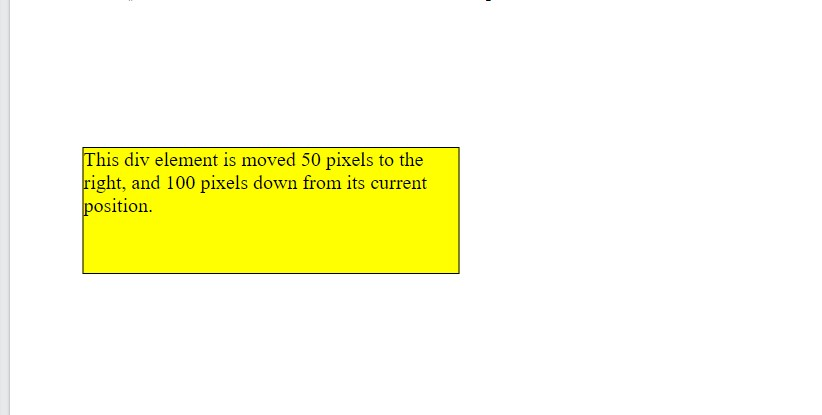

### The rotate() Method

&#10149; The `rotate()` method rotates an element clockwise or counter-clockwise according to a given degree.

### Example

    div {
      width: 300px;
      height: 100px;
      background-color: yellow;
      border: 1px solid black;
    }
    div#myDiv {
      transform: rotate(20deg);
    }

### Result:
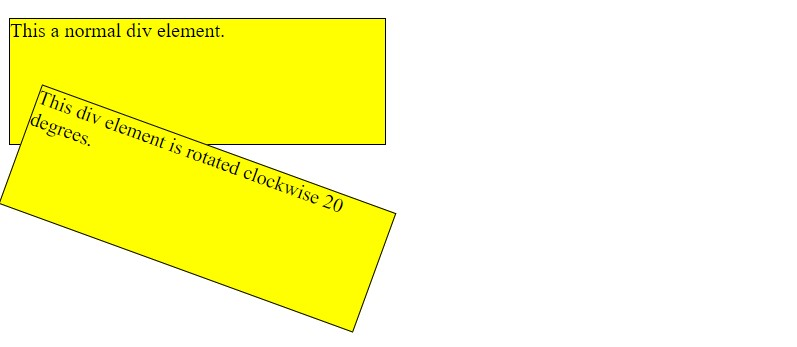

<b>Note</b>&#10071;  Using negative values will rotate the element counter-clockwise.

### The scale() Method

&#10150; The `scale()` method increases or decreases the size of an element (according to the parameters given for the width and height).

### Example

    div {
      margin: 150px;
      width: 200px;
      height: 100px;
      background-color: yellow;
      border: 1px solid black;
      transform: scale(2,3);
    }

### Result:

### The scaleX() Method

&#10151; The `scaleX()` method increases or decreases the width of an element

### Example

    div {
      margin: 150px;
      width: 200px;
      height: 100px;
      background-color: yellow;
      border: 1px solid black;
      transform: scaleX(2);
    }

### Result:
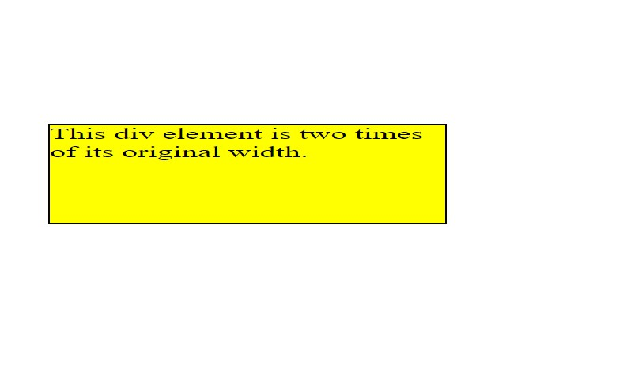

### The scaleY() Method

&#10152; The `scaleY()` method increases or decreases the height of an element.

### Example

    div {
      margin: 150px;
      width: 200px;
      height: 100px;
      background-color: yellow;
      border: 1px solid black;
      transform: scaleY(3);
    }

### Result:
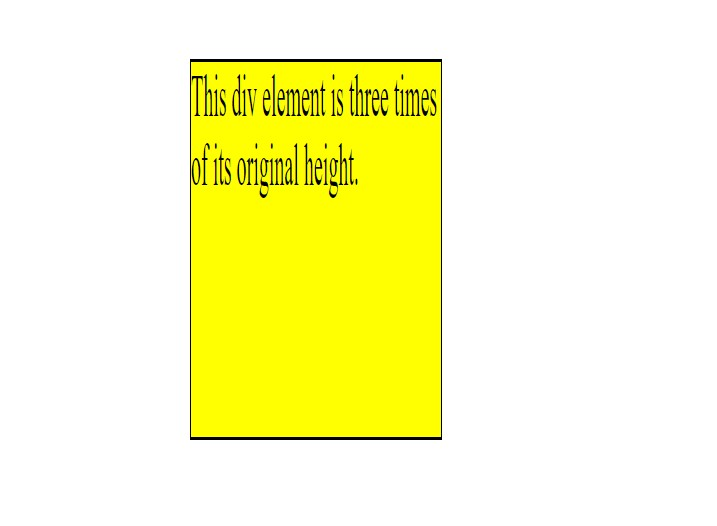

### The skewX() Method

&#10153; The `skewX()` method skews an element along the X-axis by the given angle.

### Example

    div {
      width: 300px;
      height: 100px;
      background-color: yellow;
      border: 1px solid black;
    }

    div#myDiv {
      transform: skewX(20deg);
    }

### Result:
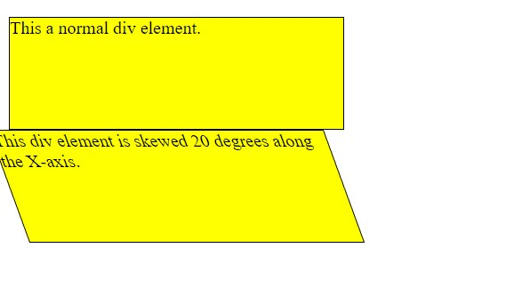

### The skewY() Method

&#10154; The `skewY()` method skews an element along the Y-axis by the given angle.

### Example

    div {
      width: 300px;
      height: 100px;
      background-color: yellow;
      border: 1px solid black;
    }

    div#myDiv {
      transform: skewY(20deg);
    }

### Result:
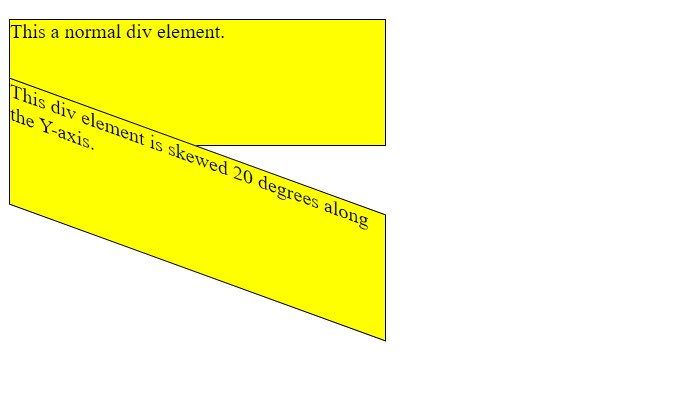

### The skew() Method
&#10155; The `skew()` method skews an element along the X and Y-axis by the given angles.

### Example

    div {
      width: 300px;
      height: 100px;
      background-color: yellow;
      border: 1px solid black;
    }

    div#myDiv {
      transform: skew(20deg,10deg);
    }

### Result:
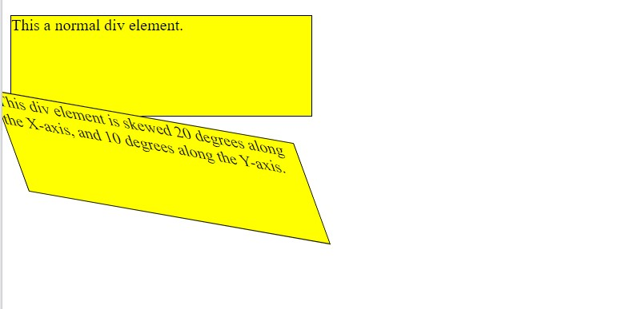

<b>Note</b>&#10071; If the second parameter is not specified, it has a zero value.

### The matrix() Method

&#10156; The  method combines all the 2D transform methods into one.

&#10156; The `matrix()` method take six parameters, containing mathematic functions, which allows you to rotate, scale, move (translate), and skew elements.

&#10156; The parameters are as follow: matrix(scaleX(), skewY(), skewX(), scaleY(), translateX(), translateY())

### Example

    div {
      width: 300px;
      height: 100px;
      background-color: yellow;
      border: 1px solid black;
    }

    div#myDiv1 {
      transform: matrix(1, -0.3, 0, 1, 0, 0);
    }

    div#myDiv2 {
      transform: matrix(1, 0, 0.5, 1, 150, 0);
    }

### Result:
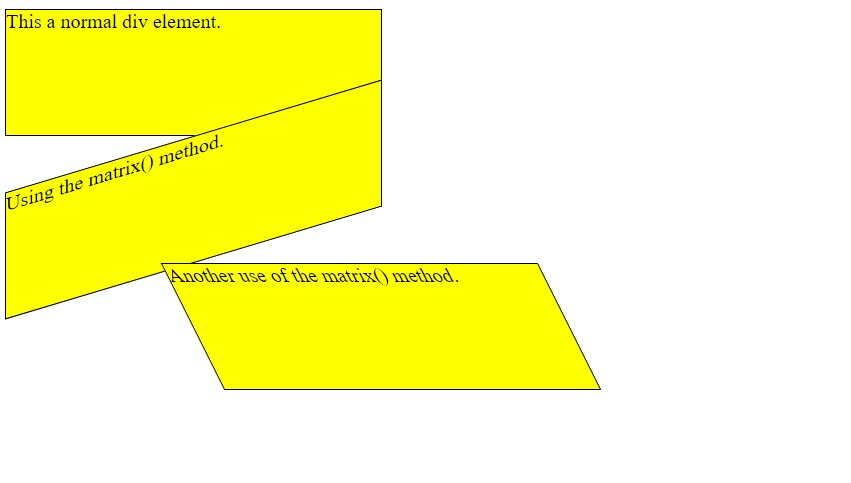

## CSS 3D Transforms

&#10157; With the CSS transform property you can use the following 3D transformation methods:

- rotateX()
- rotateY()
- rotateZ()

### The rotateX() Method

&#10157; The `rotateX()` method rotates an element around its X-axis at a given degree:

### Example

    div {
      width: 300px;
      height: 100px;
      background-color: yellow;
      border: 1px solid black;
    }

    #myDiv {
      transform: rotateX(150deg);
    }

### Result:
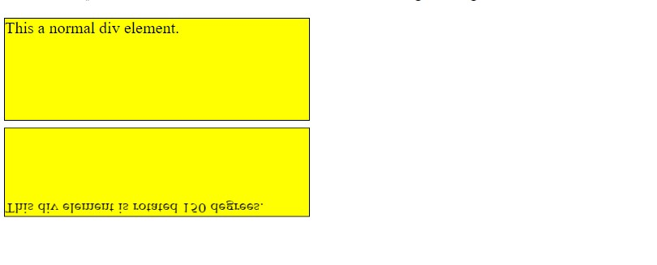

### The rotateY() Method

&#10158; The `rotateY()` method rotates an element around its Y-axis at a given degree:

### Example

    div {
      width: 300px;
      height: 100px;
      background-color: yellow;
      border: 1px solid black;
    }

    #myDiv {
      transform: rotateY(150deg);
    }

### Result:
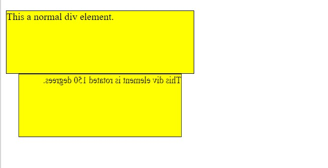

### The rotateZ() Method

&#10158; The `rotateZ()` method rotates an element around its Z-axis at a given degree:

### Example

    div {
      width: 300px;
      height: 100px;
      background-color: yellow;
      border: 1px solid black;
    }

    #myDiv {
      transform: rotateZ(90deg);
    }

### Result:
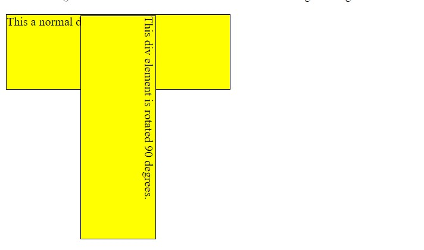

## Example Website

