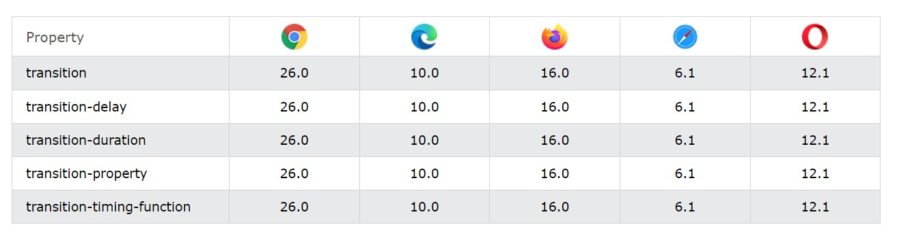

[Turn Back](../../../)
<h1 align="center">Ders10 - CSS Transitions</h1>

<h3 align="center">Languages and Tools:</h3>

  

# Introduction to CSS

## CSS Transitions

&#10147; CSS transitions allows you to change property values smoothly, over a given duration.

### Browser Support

The numbers in the table specify the first browser version that fully supports the property.

### How to Use CSS Transitions?

&#10147; To create a transition effect, you must specify two things:

- the CSS property you want to add an effect to
- the duration of the effect

<b>Note</b>&#10071; If the duration part is not specified, the transition will have no effect, because the default value is 0.

&#10147; The following example shows a 100px * 100px red `
` element. The `
` element has also specified a transition effect for the width property, with a duration of 2 seconds:

    div {
      width: 100px;
      height: 100px;
      background: red;
      transition: width 2s;
    }

&#10147; The transition effect will start when the specified CSS property (width) changes value.
&#10147; Now, let us specify a new value for the width property when a user mouses over the `
` element:

    div:hover {
      width: 300px;
    }

&#10147; Notice that when the cursor mouses out of the element, it will gradually change back to its original style.

### Specify the Speed Curve of the Transition

&#10148; The `transition-timing-function` property specifies the speed curve of the transition effect.

&#10148; The transition-timing-function property can have the following values:

- `ease` - specifies a transition effect with a slow start, then fast, then end slowly (this is default)
- `linear` - specifies a transition effect with the same speed from start to end
- `ease-in` - specifies a transition effect with a slow start
- `ease-out` - specifies a transition effect with a slow end
- `ease-in-out` - specifies a transition effect with a slow start and end
- `cubic-bezier(n,n,n,n)` - lets you define your own values in a cubic-bezier function

### Delay the Transition Effect

&#10149; The `transition-delay` property specifies a delay (in seconds) for the transition effect.

## Example Website

