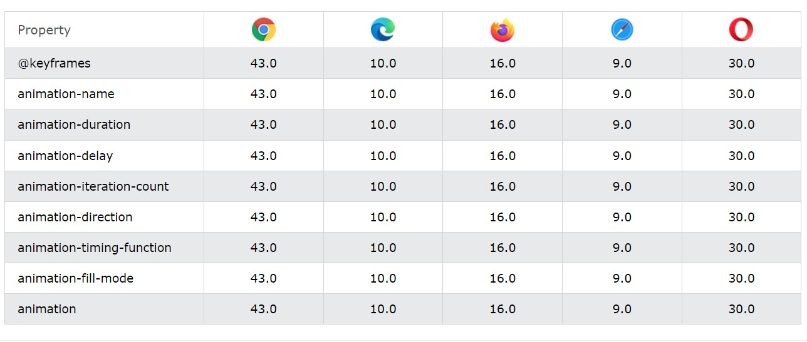

[Turn Back](../../../)

<h1 align="center">Ders10 - CSS Animations</h1>

<h3 align="center">Languages and Tools:</h3>

  

# Introduction to CSS

## CSS Animations

&#10147; CSS allows animation of HTML elements without using JavaScript or Flash!

### Browser Support

The numbers in the table specify the first browser version that fully supports the property.

### What are CSS Animations?

&#10147; An animation lets an element gradually change from one style to another.
&#10147; You can change as many CSS properties you want, as many times as you want.
&#10147; To use CSS animation, you must first specify some keyframes for the animation.
&#10147; Keyframes hold what styles the element will have at certain times.

### The @keyframes Rule

&#10148; TWhen you specify CSS styles inside the `@keyframes` rule, the animation will gradually change from the current style to the new style at certain times.
&#10148; To get an animation to work, you must bind the animation to an element.
&#10148; The following example binds the "example" animation to the `
` element. The animation will last for 4 seconds, and it will gradually change the background-color of the `
` element from "red" to "yellow":

    /* The animation code */
    @keyframes example {
      from {background-color: red;}
      to {background-color: yellow;}
    }

    /* The element to apply the animation to */
    div {
      width: 100px;
      height: 100px;
      background-color: red;
      animation-name: example;
      animation-duration: 4s;
    }

<b>Note</b>&#10071; The `animation-duration` property defines how long an animation should take to complete. If the `animation-duration` property is not specified, no animation will occur, because the default value is 0s (0 seconds).

&#10148; In the example above we have specified when the style will change by using the keywords "from" and "to" (which represents 0% (start) and 100% (complete)).

&#10148; It is also possible to use percent. By using percent, you can add as many style changes as you like.

### Delay an Animation

&#10149; The `animation-delay` property specifies a delay for the start of an animation.
&#10149; The following example has a 2 seconds delay before starting the animation:

    div {
      width: 100px;
      height: 100px;
      position: relative;
      background-color: red;
      animation-name: example;
      animation-duration: 4s;
      animation-delay: 2s;
    }

<b>Note</b>&#10071; Negative values are also allowed. If using negative values, the animation will start as if it had already been playing for N seconds.

### Set How Many Times an Animation Should Run

&#10150; The `animation-iteration-count` property specifies the number of times an animation should run.
&#10150; The following example will run the animation 3 times before it stops:

    div {
      width: 100px;
      height: 100px;
      position: relative;
      background-color: red;
      animation-name: example;
      animation-duration: 4s;
      animation-iteration-count: 3;
    }

<b>Note</b>&#10071; The "infinite" value is used to keep the animation going forever.

### Run Animation in Reverse Direction or Alternate Cycles

&#10150; The `animation-direction` property specifies whether an animation should be played forwards, backwards or in alternate cycles.
&#10150; The animation-direction property can have the following values:

- normal - The animation is played as normal (forwards). This is default
- reverse - The animation is played in reverse direction (backwards)
- alternate - The animation is played forwards first, then backwards
- alternate-reverse - The animation is played backwards first, then forwards

&#10150; The following example will run the animation in reverse direction (backwards):

    div {
      width: 100px;
      height: 100px;
      position: relative;
      background-color: red;
      animation-name: example;
      animation-duration: 4s;
      animation-direction: reverse;
    }

### Specify the Speed Curve of the Animation

&#10150; The `animation-timing-function` property specifies the speed curve of the animation.
&#10150; The animation-timing-function property can have the following values:

- ease - Specifies an animation with a slow start, then fast, then end slowly (this is default)
- linear - Specifies an animation with the same speed from start to end
- ease-in - Specifies an animation with a slow start
- ease-out - Specifies an animation with a slow end
- ease-in-out - Specifies an animation with a slow start and end
- cubic-bezier(n,n,n,n) - Lets you define your own values in a cubic-bezier function

### Specify the fill-mode For an Animation

&#10151; CSS animations do not affect an element before the first keyframe is played or after the last keyframe is played. The animation-fill-mode property can override this behavior.
&#10151; The `animation-fill-mode` property specifies a style for the target element when the animation is not playing (before it starts, after it ends, or both).
&#10151; The animation-fill-mode property can have the following values:

- none - Default value. Animation will not apply any styles to the element before or after it is executing
- forwards - The element will retain the style values that is set by the last keyframe (depends on animation-direction and animation-iteration-count)
- backwards - The element will get the style values that is set by the first keyframe (depends on animation-direction), and retain this during the animation-delay period
- both - The animation will follow the rules for both forwards and backwards, extending the animation properties in both directions

The following example lets the `
` element retain the style values from the last keyframe when the animation ends:

    div {
      width: 100px;
      height: 100px;
      background: red;
      position: relative;
      animation-name: example;
      animation-duration: 3s;
      animation-fill-mode: forwards;
    }

### CSS animation-iteration-count Property

    div {
      animation-iteration-count: 2;
    }

&#10152; The `animation-iteration-count` property specifies the number of times an animation should be played.

<table>
  <tbody><tr>
    <th style="width:20%">Value</th>
    <th style="width:68%">Description</th>
    <th>Demo</th>                
  </tr>  
  <tr>
    <td><i>number</i></td>
    <td>A number that defines how many times an animation should be played. Default value is 1</td>
  <td><a target="_blank" href="https://www.w3schools.com/cssref/playit.php?filename=playcss_animation-iteration-count&preval=1">Play it »</a></td>       
  </tr>
  <tr>
    <td>infinite</td>
    <td>Specifies that the animation should be played infinite times (for ever)</td>
  <td><a target="_blank" href="https://www.w3schools.com/cssref/playit.php?filename=playcss_animation-iteration-count&preval=infinite">Play it »</a></td>           
  </tr>
  <tr>
    <td>initial</td>
    <td>Sets this property to its default value. <a href="https://www.w3schools.com/cssref/css_initial.php">Read about <em>initial</em></a></td>
  <td></td>
    </tr>
  <tr>
    <td>inherit</td>
    <td>Inherits this property from its parent element. <a href="https://www.w3schools.com/cssref/css_inherit.php">Read about <em>inherit</em></a></td>
  <td></td>
    </tr>
  </tbody></table>

### CSS animation-name Property

&#10153; The `animation-name` property specifies a name for the @keyframes animation.

    div {
      animation-play-state: paused;
    }

<table>
  <tbody><tr>
    <th style="width:20%">Value</th>
    <th>Description</th>
  </tr>  
  <tr>
    <td><i>keyframename</i></td>
    <td>Specifies the name of the keyframe you want to bind to the selector</td>
  </tr>
  <tr>
    <td>none</td>
    <td>Default value. Specifies that there will be no animation (can be used to override animations coming from the cascade) </td>
  </tr>
  <tr>
    <td>initial</td>
    <td>Sets this property to its default value. <a href="https://www.w3schools.com/cssref/css_initial.php">Read about <em>initial</em></a></td>
  <td></td>
    </tr>
  <tr>
    <td>inherit</td>
    <td>Inherits this property from its parent element. <a href="https://www.w3schools.com/cssref/css_inherit.php">Read about <em>inherit</em></a></td>
  <td></td>
    </tr>
  </tbody></table>

### CSS animation-play-state Property

&#10154; The `animation-play-state` property specifies whether the animation is running or paused.

<b>Note</b>&#10071; Use this property in a JavaScript to pause an animation in the middle of a cycle.

    div {
      animation-play-state: paused;
    }

    div:hover {
      animation-play-state: paused;
    }

<table>
  <tbody><tr>
    <th style="width:20%">Value</th>
    <th style="width:68%">Description</th>
    <th>Demo</th>                
  </tr>  
  <tr>
    <td>paused</td>
    <td>Specifies that the animation is paused</td>
  <td><a target="_blank" href="https://www.w3schools.com/cssref/playit.php?filename=playcss_animation-play-state&preval=paused">Play it »</a></td>       
  </tr>
  <tr>
    <td>running</td>
    <td>Default value. Specifies that the animation is running</td>
  <td><a target="_blank" href="https://www.w3schools.com/cssref/playit.php?filename=playcss_animation-play-state&preval=running">Play it »</a></td>           
  </tr>
  <tr>
    <td>initial</td>
    <td>Sets this property to its default value. <a href="https://www.w3schools.com/cssref/css_initial.php">Read about <em>initial</em></a></td>
  <td></td>
    </tr>
  <tr>
    <td>inherit</td>
    <td>Inherits this property from its parent element. <a href="https://www.w3schools.com/cssref/css_inherit.php">Read about <em>inherit</em></a></td>
  <td></td>
    </tr>
</tbody></table>

### CSS animation-timing-function Property

&#10155; The `animation-timing-function` specifies the speed curve of an animation.

&#10155; The speed curve defines the TIME an animation uses to change from one set of CSS styles to another.

&#10155; The speed curve is used to make the changes smoothly.

<b>Note</b>&#10071; The animation-timing-function uses a mathematical function, called the Cubic Bezier curve, to make the speed curve. You can use your own values in this function, or use one of the pre-defined values:

<table>
  <tbody><tr>
    <th style="width:20%">Value</th>
    <th style="width:68%">Description</th>
    <th>Demo</th>                
  </tr>  
  <tr>
    <td>linear</td>
    <td>The animation has the same speed from start to end</td>
  <td><a target="_blank" href="https://www.w3schools.com/cssref/playit.php?filename=playcss_animation-timing-function&preval=linear">Play it »</a></td>       
  </tr>
  <tr>
    <td>ease</td>
    <td>Default value. The animation has a slow start, then fast, before it ends slowly</td>
  <td><a target="_blank" href="https://www.w3schools.com/cssref/playit.php?filename=playcss_animation-timing-function&preval=ease">Play it »</a></td>        
  </tr>
  <tr>
    <td>ease-in</td>
    <td>The animation has a slow start</td>
  <td><a target="_blank" href="https://www.w3schools.com/cssref/playit.php?filename=playcss_animation-timing-function&preval=ease-in">Play it »</a></td>        
  </tr>
  <tr>
    <td>ease-out</td>
    <td>The animation has a slow end</td>
  <td><a target="_blank" href="https://www.w3schools.com/cssref/playit.php?filename=playcss_animation-timing-function&preval=ease-out">Play it »</a></td>            
  </tr>
  <tr>
    <td>ease-in-out</td>
    <td>The animation has both a slow start and a slow end</td>
  <td><a target="_blank" href="https://www.w3schools.com/cssref/playit.php?filename=playcss_animation-timing-function&preval=ease-in-out">Play it »</a></td>            
  </tr>
  <tr>
    <td>step-start</td>
    <td>Equivalent to steps(1, start)</td>
  <td></td>
    </tr>
  <tr>
    <td>step-end</td>
    <td>Equivalent to steps(1, end)</td>
  <td></td>    
    </tr>
  <tr>
    <td>steps(int,start|end)</td>
    <td>Specifies a stepping function, with two parameters. The first parameter specifies the number of intervals in the function. It must be a positive integer (greater than 0). The second parameter, which is optional, is either the value "start" or "end", and specifies the point at which the change of values occur within the interval. If the second parameter is omitted, it is given the value "end"</td>
  <td></td> 
    </tr>
  <tr>
    <td><a href="https://www.w3schools.com/cssref/func_cubic-bezier.php">cubic-bezier(<i>n</i>,<i>n</i>,<i>n</i>,<i>n</i>)</a></td>
    <td>Define your own values in the cubic-bezier function 
 Possible values are numeric values from 0 to 1</td>
  <td></td>
  </tr>
  <tr>
    <td>initial</td>
    <td>Sets this property to its default value. <a href="https://www.w3schools.com/cssref/css_initial.php">Read about <em>initial</em></a></td>
  <td></td>
    </tr>
  <tr>
    <td>inherit</td>
    <td>Inherits this property from its parent element. <a href="https://www.w3schools.com/cssref/css_inherit.php">Read about <em>inherit</em></a></td>
  <td></td>
    </tr>
</tbody></table>

    #div1 {animation-timing-function: linear;}
    #div2 {animation-timing-function: ease;}
    #div3 {animation-timing-function: ease-in;}
    #div4 {animation-timing-function: ease-out;}
    #div5 {animation-timing-function: ease-in-out;}

    #div1 {animation-timing-function: cubic-bezier(0,0,1,1);}
    #div2 {animation-timing-function: cubic-bezier(0.25,0.1,0.25,1);}
    #div3 {animation-timing-function: cubic-bezier(0.42,0,1,1);}
    #div4 {animation-timing-function: cubic-bezier(0,0,0.58,1);}
    #div5 {animation-timing-function: cubic-bezier(0.42,0,0.58,1);}

## Example Website

