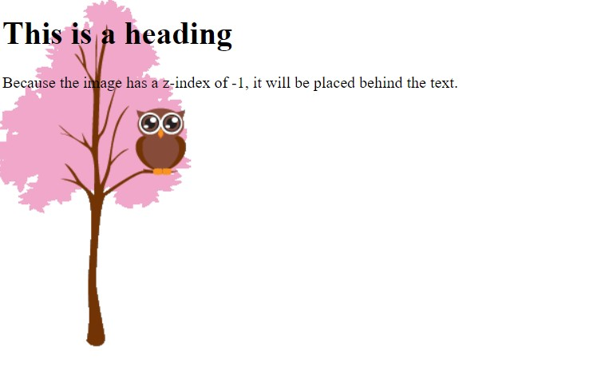
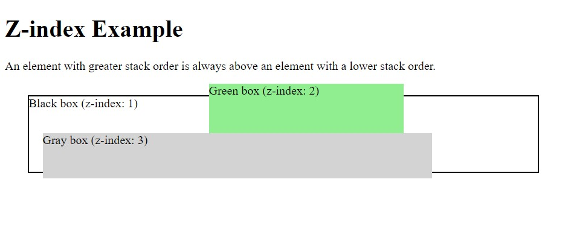
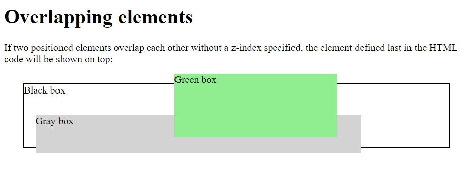

[Turn Back](../../)

<h1 align="center">Ders11 - z-index Property</h1>

<h3 align="center">Languages and Tools:</h3>

  

# Introduction to CSS

## The z-index Property

&#10147; The `z-index` property specifies the stack order of an element.

&#10147; When elements are positioned, they can overlap other elements.
&#10147; The z-index property specifies the stack order of an element (which element should be placed in front of, or behind, the others).

&#10147; An element can have a positive or negative stack order:

### Example
    img {
      position: absolute;
      left: 0px;
      top: 0px;
      z-index: -1;
    }

### Result:

<b>Note</b>&#10071; `z-index` only works on <u>positioned elements</u>(position: absolute, position: relative, position: fixed, or position: sticky) and <u>flex items</u> (elements that are direct children of display: flex elements).

### Example
    Here we see that an element with greater stack order is always above an element with a lower stack order:

        <html>
        <head>
        
        </head>
        <body>

        

          
Black box

          
Gray box

          
Green box

        

        </body>
        </html>

### Result:

## Without z-index

&#10148; If two positioned elements overlap each other without a z-index specified, the element defined last in the HTML code will be shown on top.

### Example
    Same example as above, but here with no z-index specified:

        <html>
        <head>
        
        </head>
        <body>

        

          
Black box

          
Gray box

          
Green box

        

        </body>
        </html>

### Result:

