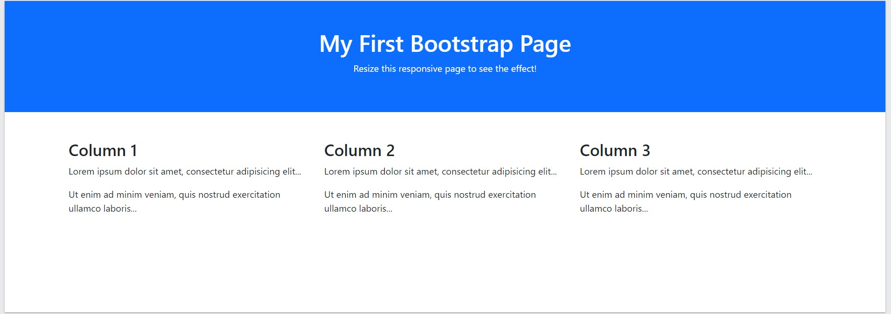

[Turn Back](../../)

<h1 align="center">Ders14 - Bootstrap</h1>

<h3 align="center">Languages and Tools:</h3>

  

# Introduction to Bootstrap

## Bootstrap

### What is Bootstrap?

- Bootstrap is a free front-end framework for faster and easier web development
- Bootstrap includes HTML and CSS based design templates for typography, forms, buttons, tables, navigation, modals, image carousels and many other, as well as optional JavaScript plugins
- Bootstrap also gives you the ability to easily create responsive designs

### What is Responsive Web Design?

&#10147;  Responsive web design is about creating web sites which automatically adjust themselves to look good on all devices, from small phones to large desktops.

#### Example

      

        <h1>My First Bootstrap Page</h1>
        
Resize this responsive page to see the effect!

      

      

        

          

            <h3>Column 1</h3>
            
Lorem ipsum dolor sit amet, consectetur adipisicing elit...

            
Ut enim ad minim veniam, quis nostrud exercitation ullamco laboris...

          

          

            <h3>Column 2</h3>
            
Lorem ipsum dolor sit amet, consectetur adipisicing elit...

            
Ut enim ad minim veniam, quis nostrud exercitation ullamco laboris...

          

          

            <h3>Column 3</h3>
            
Lorem ipsum dolor sit amet, consectetur adipisicing elit...

            
Ut enim ad minim veniam, quis nostrud exercitation ullamco laboris...

          

        

      

#### Result:

### Bootstrap Versions

&#10148; Bootstrap 5 (released 2021) is the newest version of Bootstrap (released 2013); with new components, faster stylesheet and more responsiveness.

&#10148; Bootstrap 5 supports the latest, stable releases of all major browsers and platforms. However, Internet Explorer 11 and down is not supported.

&#10148; The main differences between Bootstrap 5 and Bootstrap 3 & 4, is that Bootstrap 5 has switched to vanilla JavaScript instead of jQuery.

<b>Note</b>&#10071; Bootstrap 3 and Bootstrap 4 is still supported by the team for critical bugfixes and documentation changes, and it is perfectly safe to continue to use them. However, new features will NOT be added to them.

### Why Use Bootstrap?

Advantages of Bootstrap:

- <b>Easy to use:</b> Anybody with just basic knowledge of HTML and CSS can start using Bootstrap
- <b>Responsive features:</b> Bootstrap's responsive CSS adjusts to phones, tablets, and desktops
- <b>Mobile-first approach:</b> In Bootstrap, mobile-first styles are part of the core framework
- <b>Browser compatibility:</b> Bootstrap 5 is compatible with all modern browsers (Chrome, Firefox, Edge, Safari, and Opera). Note that if you need support for IE11 and down, you must use either BS4 or BS3.

### Where to Get Bootstrap 5?

&#10149; There are two ways to start using Bootstrap 5 on your own web site.

- Include Bootstrap 5 from a CDN
- Download Bootstrap 5 from getbootstrap.com

### Bootstrap 5 CDN

&#10149; If you don't want to download and host Bootstrap 5 yourself, you can include it from a CDN (Content Delivery Network).
jsDelivr provides CDN support for Bootstrap's CSS and JavaScript:

    MaxCDN:
      <!-- Latest compiled and minified CSS -->
      <link href="https://cdn.jsdelivr.net/npm/bootstrap@5.2.3/dist/css/bootstrap.min.css" rel="stylesheet">

      <!-- Latest compiled JavaScript -->
      

#### One advantage of using the Bootstrap 5 CDN:
Many users already have downloaded Bootstrap 5 from jsDelivr when visiting another site. As a result, it will be loaded from cache when they visit your site, which leads to faster loading time. Also, most CDN's will make sure that once a user requests a file from it, it will be served from the server closest to them, which also leads to faster loading time.

#### JavaScript?
Bootstrap 5 uses JavaScript for different components (like modals, tooltips, popovers etc). However, if you just use the CSS part of Bootstrap, you don't need them.

### Downloading Bootstrap 5

&#10149; If you want to download and host Bootstrap 5 yourself, go to https://getbootstrap.com/, and follow the instructions there.

## Example Website

