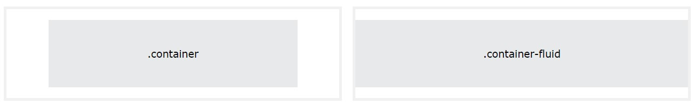
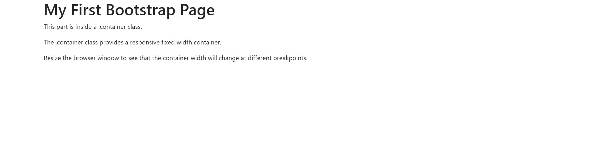
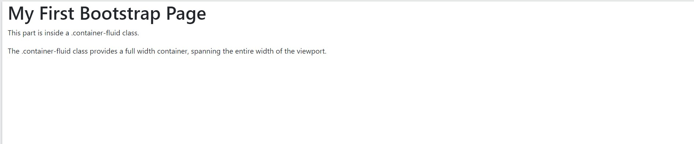

[Turn Back](../../)

<h1 align="center">Ders15 - Bootstrap</h1>

<h3 align="center">Languages and Tools:</h3>

 <a href="https://www.w3schools.com/css/" target="_blank" rel="noreferrer">   </a> 

# Introduction to Bootstrap

### Create Web Page With Bootstrap 5

1. Add the HTML5 doctype

&#10147; Bootstrap 5 uses HTML elements and CSS properties that require the HTML5 doctype.

&#10147; Always include the HTML5 doctype at the beginning of the page, along with the lang attribute and the correct title and character set:

    <!DOCTYPE html>
    <html lang="en">
      <head>
        <title>Bootstrap 5 Example</title>
        <meta charset="utf-8">
      </head>
    </html>

2. Bootstrap 5 is mobile-first

&#10147; Bootstrap 5 is designed to be responsive to mobile devices. Mobile-first styles are part of the core framework.

&#10147; To ensure proper rendering and touch zooming, add the following `<meta>` tag inside the `<head>` element:

    <meta name="viewport" content="width=device-width, initial-scale=1">

The `width=device-width` part sets the width of the page to follow the screen-width of the device (which will vary depending on the device).

The `initial-scale=1` part sets the initial zoom level when the page is first loaded by the browser.

3. Containers

&#10147; Bootstrap 5 also requires a containing element to wrap site contents.

&#10147; There are two container classes to choose from:

- 1. The `.container` class provides a responsive <b>fixed width container</b>
- 2. The `.container-fluid` class provides a <b>full width container</b>, spanning the entire width of the viewport

&#10147; The following example shows the code for a basic Bootstrap 5 page (with a responsive fixed width container):

#### Container Example

    <!DOCTYPE html>
    <html lang="en">
    <head>
      <title>Bootstrap Example</title>
      <meta charset="utf-8">
      <meta name="viewport" content="width=device-width, initial-scale=1">
      <link href="https://cdn.jsdelivr.net/npm/bootstrap@5.2.3/dist/css/bootstrap.min.css" rel="stylesheet">
      
    </head>
    <body>

    

      <h1>My First Bootstrap Page</h1>
      
This part is inside a .container class.

      
The .container class provides a responsive fixed width container.

    

    </body>
    </html>

#### Result:

&#10147; The following example shows the code for a basic Bootstrap 5 page (with a full width container):

#### Container Fluid Example

    <!DOCTYPE html>
    <html lang="en">
    <head>
      <title>Bootstrap Example</title>
      <meta charset="utf-8">
      <meta name="viewport" content="width=device-width, initial-scale=1">
      <link href="https://cdn.jsdelivr.net/npm/bootstrap@5.2.3/dist/css/bootstrap.min.css" rel="stylesheet">
      
    </head>
    <body>

    

      <h1>My First Bootstrap Page</h1>
      
This part is inside a .container-fluid class.

      
The .container-fluid class provides a full width container, spanning the entire width of the viewport.

    

    </body>
    </html>

#### Result:

#### For more information visit: https://getbootstrap.com/

## Example Website

