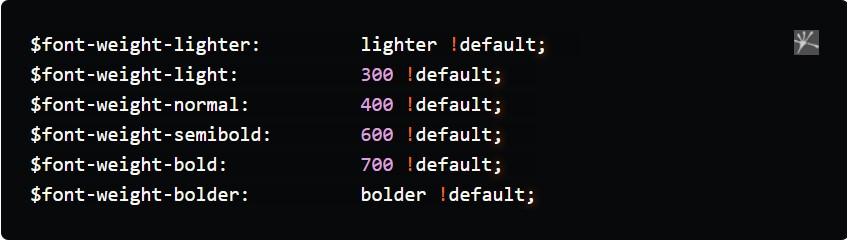
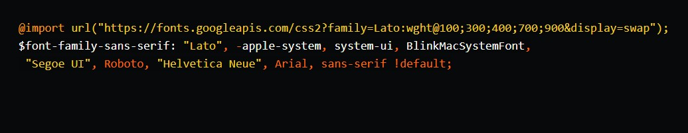
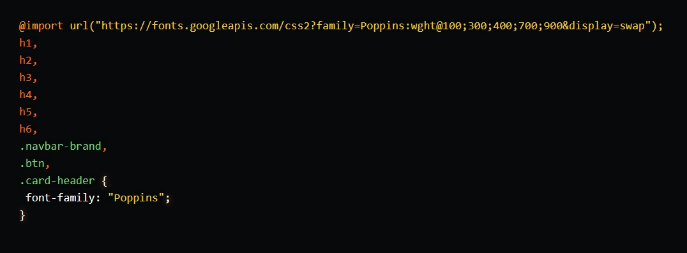

[Turn Back](../../../)

<h1 align="center">Ders16 - Bootstrap-Scss</h1>

<h3 align="center">Languages and Tools:</h3>

 <a href="https://www.w3schools.com/css/" target="_blank" rel="noreferrer">    </a> 

# Introduction to Bootstrap and Scss

## How to Use Sass with Bootstrap

&#10147; Until Bootstrap version 3.x, you had a choice between CSS preprocessors: Less or Sass. But since version 4, Bootstrap uses only Sass. The source code for the Bootstrap 4 and 5 frameworks is written entirely in Sass, which is a testimony to how mature Sass has become.

&#10147; There are multiple ways of adding Bootstrap to a project, like using a CDN link, which promises speed/snappiness. Another common option has been downloading, which has worked great and allows you to edit it as you continue to develop the project. However, since Bootstrap 4, there has been the package-manager option, allowing you to install it as a package. And it will work regardless of whichever framework you are using, be it laravel, vue/react-cli, nuxt or even symfony.

&#10147; Bootstrap package will ship with all its source code, and for the styling part, it is all written in Sass. There is a compiled file available if you need it, of course. Going back to the Sass part, you can add it to your project sass so that everything gets compiled at once, Bootstrap and your custom CSS code. Easy enough, right? The best part about this, however, is the <a href="https://github.com/twbs/bootstrap/blob/v5.1.1/scss/_variables.scss">sass variables</a>.

&#10147; All of Bootstrap source relies on a single file with a long list of variables, all of which can be overwritten. What’s fun about that is how you can just change literally everything about a project’s design by just overwriting these variables, without writing any single CSS rule/property, or using the dreaded !important rule. And it works for simple things such as changing the color of your primary button/links to changing container sizes across your breakpoints, to add as many spacings as you wish instead of the usual 5. You get to enjoy the cleanliness and orderliness of Bootstrap CSS, but at the same time having it work for you.

### How Customizing Bootstrap Works

&#10148; Bootstrap 5 uses SASS to compile CSS files using variables and mixins. One cool feature of SASS variables is the `!default` property. Defining a variable like this: `$white: #fff !default`;, tells the SASS compiler to set the variable named `$white` to `#fff` unless the variable `$white` is already defined.

&#10148; Luckily for us, <a href="https://github.com/twbs/bootstrap/blob/main/scss/_variables.scss">Bootstrap's variables</a> are all defined with `!default` so we can overwrite them before we compile the library.

&#10148; For example: try adding the line `$primary: blue;` in our `theme.scss` file before the line that imports the Bootstrap library. Save, then check out the app in the browser. The navbar and primary button should be a blue now! Any variable can be overwritten by redefining the variable before importing Bootstrap. This feature lets you change the library to fit your exact style and needs!

### Adding your own Colors

&#10149; Like `$primary`, you can override any color you like in Bootstrap. Check out the <a href="https://getbootstrap.com/docs/5.2/customize/color/">colors documentation</a> for all the main colors to override.
The main color variables you'll work with are:

- $primary
- $secondary
- $success
- $info
- $warning
- $danger
- $light
- $dark

&#10149; Overwriting any one of these will give your app a custom feel already! Bootstrap defines these in the `$theme-colors` variable. If you redefine that map, you can add any color you like to bootstrap. For example, what would happen if we add a $tertiary variable to the $theme-colors map? Bootstrap would generate utility classes like: `bg-tertiary`, `btn-tertiary`, etc.

### Importing New Fonts

&#10150; Something as simple as changing a font can give your app a custom look and feel. Bootstrap also provides variables for fonts so they're easy to overwrite, but there are some gotchas to look out for.

&#10150; Bootstrap has utility classes for fonts built in. These let you apply different weights to fonts like light, bold, etc. To get a font that will work out of the box, we need to know what weights Bootstrap supports. In the variables file, Bootstrap defines:

&#10150; To accommodate the lighter and bolder weights, we'll need to include 100 and 900 weights too.

&#10150; To bring in custom fonts, we can use Google fonts here: https://fonts.google.com/. We'll use the Lato font since it has all the weights we need! To import it, use the @import directive in SASS like so:

&#10150; Overwriting the `$font-family-serif` variable tells Bootstrap to use our imported Lato font. Now our application has a beautiful default font!

&#10150; You can import fonts and apply them only to specific elements as well!

&#10150; Change fonts further by playing around with the `$font-` variables. For instance, changing the `$font-size-base` to `1.2rem` increases your font size across all elements.

&#10150; Fonts set the tone for your visitors and can change a site from feeling basic to bespoke!

## Example Website

