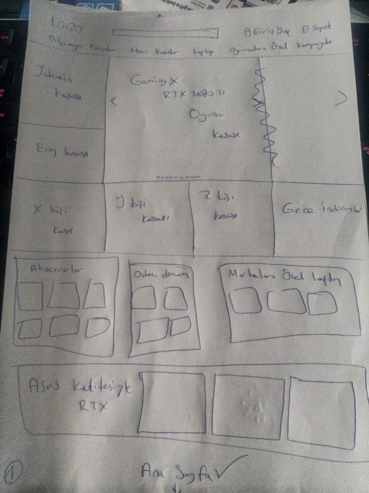
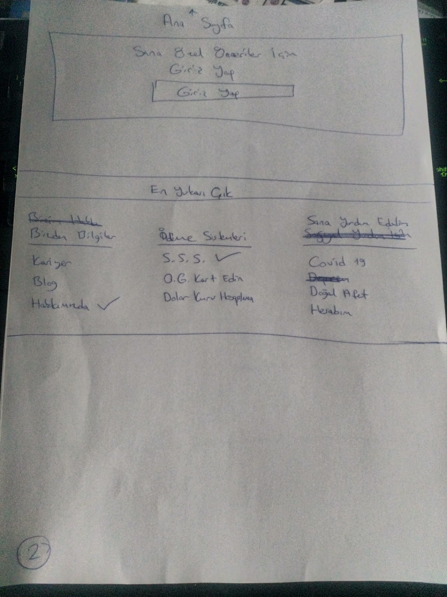
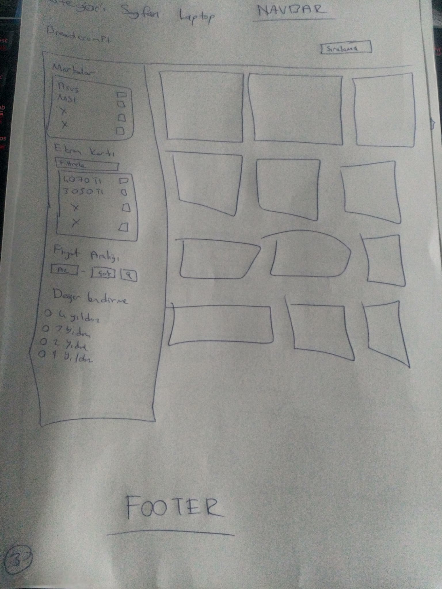
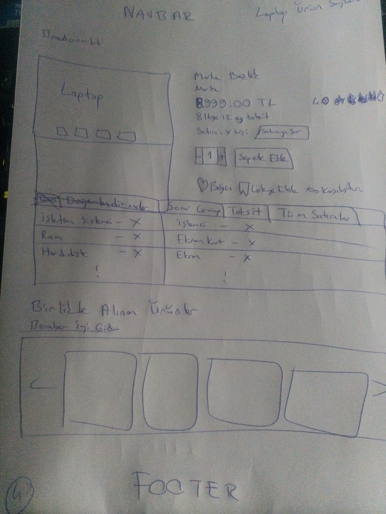
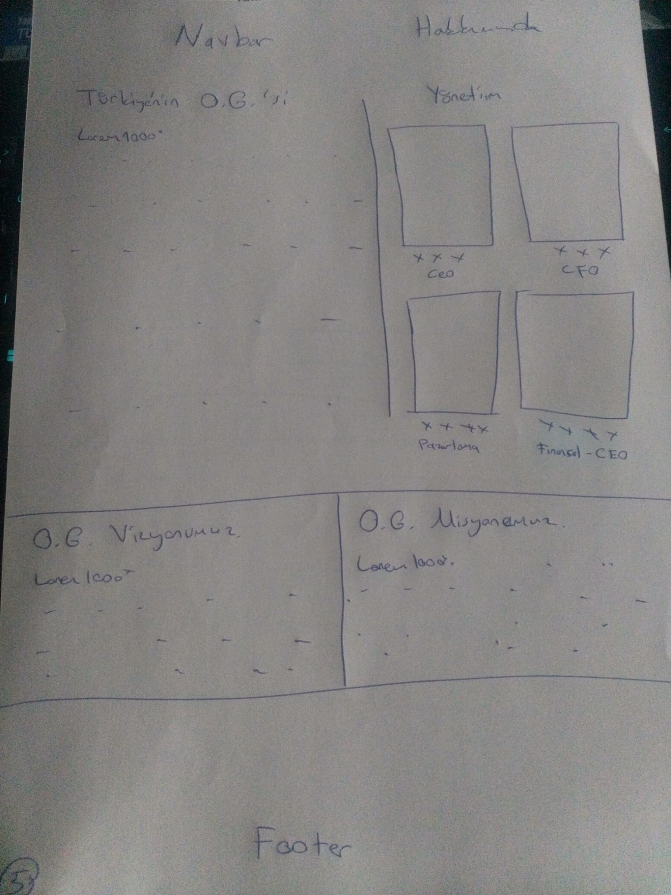
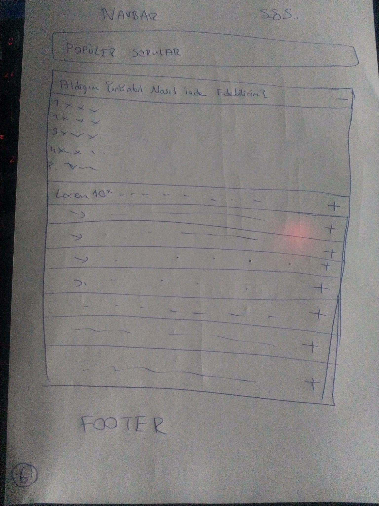

# OG Mağazası Kurulum Ve Sunum Rehberi

- JS dosyası node modules içerisinde bulunmaktadır, bu sebeple kurulum yapılmazsa bazı özellikler çalışmayabilir.

### Gereksinimler

- Güncel bir paket yöneticisi bilgisayarda yüklü olmalıdır, kodlanırken npm tercih edildiği için örnekte npm yer almaktadır.

## Kurulum

- `npm install`
- `npm run scss`

#### Kurulumda sorun yaşarsanız

- Önce package-lock.json dosyasını ve node_modules klasörünü silin.
- Sonra kurulum adımını tekrarlayın.

## Proje Hakkında

- Proje Turkcell Geleceği Yazanlar 2023 Bootcamp İlk Ödevi olarak hazırlanmıştır.
- Bootstrap ve Scss kullanılarak yazılmıştır.
- Tasarımda sektörün öncü sitelerinden ilham alınmış ve iyi olan tarafları harman edilmiştir.
- Ürün resimleri https://www.itopya.com dan alınmıştır.
- İlham alınan diğer siteler:
  - https://www.trendyol.com,
  - https://www.hepsiburada.com,
  - https://www.n11.com,
  - https://www.amazon.com/
- Projede ortak navigasyon ve footer kullanılmıştır, her sayfada aynıdır.
- Tüm sayfalar olmadığı için var olan linkler # ile işaretlenmiş olup diğer linkler için 404 sayfası hazırlanmıştır.
- Hakkımızda kısmında içerik chatgpt ye yazdırılmıştır ve kullanılan insan görselleri hepsiburada.com dan alınmıştır.
- Kullanıcı deneyimi ön planda tutulmuştur, gereksiz detaylar eklenmemiştir.
- Mobil cihazlarda performans kaybetmemek adına ürünlerde gölge efekti yoktur, pc de vardır.
- Pc ve mobil uyumluluğu sağlanmıştır, tablette verimli çalışmamaktadır.
- Genel pc deneyimini standartlaştırmak adına xxl: 1400px breakpoint'i kullanılmamıştır.
- Resimler internetten link olarak geldiği için boyut optimizasyonu yapılmamıştır, bu yüzden bazı resimler yüksek çözünürlükte olup sayfanın performans puanını düşürmektedir buna rağmen lazy loading ile 5-10 puanlık performans artışı sağlandı ve içerikleri doldurularak seo puanında da artış sağlandı. Ayrıca resimlerin kalitesini eğer server destekliyorsa düşüren ?quality=50 gibi bir parametre eklendi ancak etkisi görünmedi.
- Genel olarak erişilebilirlik ve seo puanlamasında 90+ puan alınmıştır, testten teste değişimler olmaktadır.

#### Renkler ve Seçim Sebepleri

- Mavi: #3c486b;
  - Seçilme sebebi güven ve sadakati yansıtmasının yanında kullanıcıyı rahatlatmasıdır, koyu bir mavi tonu seçilmiş ve tüm siteye siyahmışçasına uygulanmıştır buda kullanıcının dikkatını dağıtmamak içindir.
- Sarı: #f9d949;
  - Seçilme sebebi kullanıcının özgüvenini hissettirmek ve harekete geçirmek.
- Kırmızı: #f45050;
  - Turuncuya yakın kırmızı seçilme sebebi agresif ve olumsuz kısımlarda kullanıcıyı daha iyimser şekle getirmesi ve olumsuzluğu bir nebze azaltmaktır.
- Beyaz: #f0f0f0;
  - Mavi tonuna benzer bir beyazdır ve seçilme sebebi ana uyumluluğu bozmadan göz yorgunluğunu azaltmaktır.

#### Font

- Bootstrap Standart

#### İkonlar

- Bootstrap İkonları

#### Wireframes

